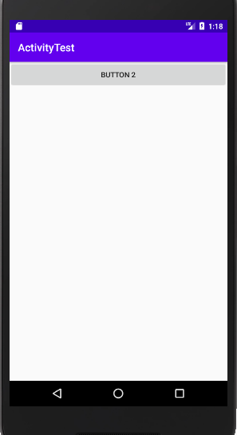
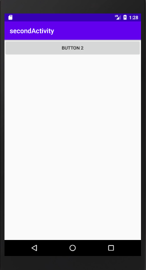

## 1.Intent
### 1.1. 显示Intent
```markdown
我们首先构建出了一个Intent,传入FirstActivity.this作为上下文，传入SecondActivity.class作为目标活动，这样我们的“意图”就非常明显了，即在MainActivity这个活 动的基础上打开SecondActivity这个活动。然后通过startActivity。方法来执行这个Intent
```


* 显式Intent
```java
package com.yxj.activitytest;

import androidx.appcompat.app.AppCompatActivity;

import android.os.Bundle;

public class SecondActivity extends AppCompatActivity {

    @Override
    protected void onCreate(Bundle savedInstanceState) {
        super.onCreate(savedInstanceState);
        setContentView(R.layout.second_layout);
    }
}

<?xml version="1.0" encoding="utf-8"?>
<androidx.constraintlayout.widget.ConstraintLayout xmlns:android="http://schemas.android.com/apk/res/android"
    xmlns:app="http://schemas.android.com/apk/res-auto"
    xmlns:tools="http://schemas.android.com/tools"
    android:layout_width="match_parent"
    android:layout_height="match_parent"
    tools:context=".SecondActivity">

    <Button
        android:id="@+id/button_2"
        android:layout_width="match_parent"
        android:layout_height="wrap_content"
        android:text="Button 2">

    </Button>
</androidx.constraintlayout.widget.ConstraintLayout>


package com.yxj.activitytest;

import androidx.annotation.NonNull;
import androidx.appcompat.app.AppCompatActivity;

import android.content.Intent;
import android.os.Bundle;
import android.view.Menu;
import android.view.MenuItem;
import android.view.View;
import android.widget.Button;
import android.widget.Toast;
import android.widget.Toolbar;

public class FirstActivity extends AppCompatActivity {

    @Override
    protected void onCreate(Bundle savedInstanceState) {
        super.onCreate(savedInstanceState);
        setContentView(R.layout.first_layout);
        Button button1 = (Button) findViewById(R.id.button_1);
        button1.setOnClickListener(new View.OnClickListener() {
            @Override
            public void onClick(View v) {
                Intent intent = new Intent(FirstActivity.this, SecondActivity.class);
                startActivity(intent);
            }
        });

    }

    @Override
    public boolean onCreateOptionsMenu(Menu menu) {
        getMenuInflater().inflate(R.menu.main,menu);
        return true;
    }


    @Override
    public boolean onOptionsItemSelected(@NonNull MenuItem item) {
        switch (item.getItemId()){
            case R.id.add_item:
                Toast.makeText(this,"You clicked Add", Toast.LENGTH_SHORT).show();
                break;
            case R.id.remove_item:
                Toast.makeText(this,"You clicked Remove",Toast.LENGTH_SHORT).show();
                break;
            default:
        }
        return true;
    }
}

```



### 1.2 隐式Intent

```markdown
相比于显式Intent,隐式Intent则含蓄了许多，它并不明确指出我们想要启动哪一个活动， 而是指定了一系列更为抽象的action和category等信息，然后交由系统去分析这个Intent, 并帮我们找岀合适的活动去启动。
```
```java
<?xml version="1.0" encoding="utf-8"?>
<manifest xmlns:android="http://schemas.android.com/apk/res/android"
    package="com.yxj.activitytest">

    <application
        android:allowBackup="true"
        android:icon="@mipmap/ic_launcher"
        android:label="@string/app_name"
        android:roundIcon="@mipmap/ic_launcher_round"
        android:supportsRtl="true"
        android:theme="@style/AppTheme">
        <activity android:name=".SecondActivity" android:label="secondActivity">
            <intent-filter>
            // 只有<action＞和〈category〉中的内容同时能够匹配上Intent中指定的action和category时，这个活动才能响应该Intent
                <action android:name="com.yxj.activitytest.ACTION_START"></action>
                <category android:name="android.intent.category.DEFAULT"></category>
                <category android:name="com.yxj.activitytest.MY_CATEGORY"></category>
            </intent-filter>
        </activity>
        <activity
            android:name=".MainActivity"
            android:label="This is  MainActivity">
            <intent-filter>
                <action android:name="android.intent.action.MAIN" />

                <category android:name="android.intent.category.LAUNCHER" />
            </intent-filter>
        </activity>
    </application>

</manifest>


package com.yxj.activitytest;

import androidx.annotation.NonNull;
import androidx.appcompat.app.AppCompatActivity;

import android.content.Intent;
import android.os.Bundle;
import android.view.Menu;
import android.view.MenuItem;
import android.view.View;
import android.widget.Button;
import android.widget.Toast;
import android.widget.Toolbar;

public class FirstActivity extends AppCompatActivity {

    @Override
    protected void onCreate(Bundle savedInstanceState) {
        super.onCreate(savedInstanceState);
        setContentView(R.layout.first_layout);
        Button button1 = (Button) findViewById(R.id.button_1);
        button1.setOnClickListener(new View.OnClickListener() {
            @Override
            public void onClick(View v) {
                Intent intent = new Intent("com.yxj.activitytest.ACTION_START");
 // 不是说要＜action＞和〈category〉同时匹配上才能响应的吗？怎么没看到哪里有指定 category 呢？这是因为 android.intent. category.DEFAULT 是一种默认的 category,在调 用startActivity()方法的时候会自动将这个category添加到Intent中.每个Intent中只能指定一个action,但却能指定多个category
              intent.addCategory("com.yxj.activitytest.MY_CATEGORY");
                startActivity(intent);
            }
        });
    }
}

```


### 1.3 更多隐式Intent的用法

```markdown
使用隐式Intent,我们不仅可以启动自己程序内的活动，还可以启动其他程序的活动，这使 得Android多个应用程序之间的功能共享成为了可能
```
#### 1.3.1 使用内置浏览器
```java
package com.yxj.activitytest;

import androidx.annotation.NonNull;
import androidx.appcompat.app.AppCompatActivity;

import android.content.Intent;
import android.net.Uri;
import android.os.Bundle;
import android.view.Menu;
import android.view.MenuItem;
import android.view.View;
import android.widget.Button;
import android.widget.Toast;
import android.widget.Toolbar;

public class FirstActivity extends AppCompatActivity {

    @Override
    protected void onCreate(Bundle savedInstanceState) {
        super.onCreate(savedInstanceState);
        setContentView(R.layout.first_layout);
        Button button1 = (Button) findViewById(R.id.button_1);
        button1.setOnClickListener(new View.OnClickListener() {
            @Override
            public void onClick(View v) {
            // 这里我们首先指定了 Intent的action是Intent .ACTION_VIEW,这是一个Android系统内 置的动作，其常量值为android .intent .action. VIEW。然后通过Uri.parse()方法，将一个 网址字符串解析成一个Url对象，再调用Intent的setData ()方法将这个Uri对象传递进去。
                Intent intent = new Intent(Intent.ACTION_VIEW);
                intent.setData(Uri.parse("http://www.baidu.com")); startActivity(intent);
            }
        });
    }
}
```

#### 1.3.2 使用内置电话
```java
package com.yxj.activitytest;

import androidx.annotation.NonNull;
import androidx.appcompat.app.AppCompatActivity;

import android.content.Intent;
import android.net.Uri;
import android.os.Bundle;
import android.view.Menu;
import android.view.MenuItem;
import android.view.View;
import android.widget.Button;
import android.widget.Toast;
import android.widget.Toolbar;

public class FirstActivity extends AppCompatActivity {

    @Override
    protected void onCreate(Bundle savedInstanceState) {
        super.onCreate(savedInstanceState);
        setContentView(R.layout.first_layout);
        Button button1 = (Button) findViewById(R.id.button_1);
        button1.setOnClickListener(new View.OnClickListener() {
            @Override
            public void onClick(View v) {
                //Intent intent = new Intent(Intent.ACTION_VIEW);
                //intent.setData(Uri.parse("http://www.baidu.com"));
                Intent intent = new Intent(Intent.ACTION_DIAL);  // Intent .ACTION_DIAL,这又是一个Android系统的内置电话动 作
                intent.setData(Uri.parse("tel:10086"));
                startActivity(intent);
            }
        });

    }

    @Override
    public boolean onCreateOptionsMenu(Menu menu) {
        getMenuInflater().inflate(R.menu.main,menu);
        return true;
    }


    @Override
    public boolean onOptionsItemSelected(@NonNull MenuItem item) {
        switch (item.getItemId()){
            case R.id.add_item:
                Toast.makeText(this,"You clicked Add", Toast.LENGTH_SHORT).show();
                break;
            case R.id.remove_item:
                Toast.makeText(this,"You clicked Remove",Toast.LENGTH_SHORT).show();
                break;
            default:
        }
        return true;
    }
}
```


