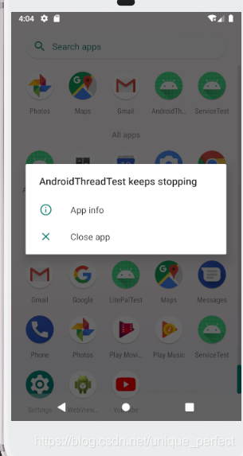
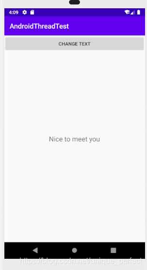
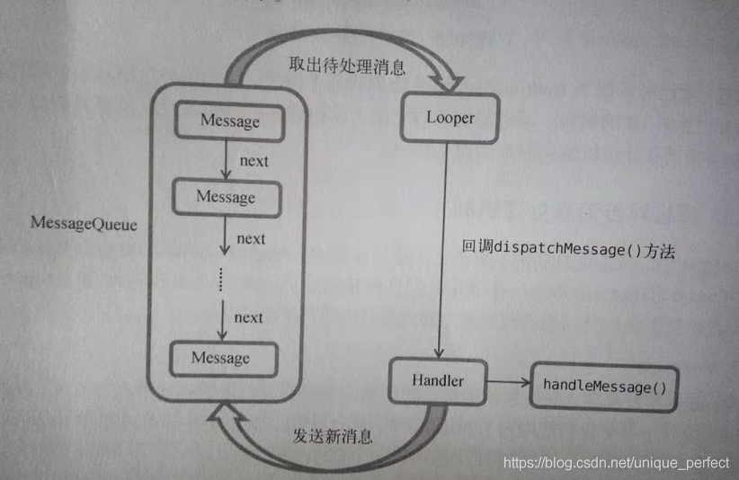
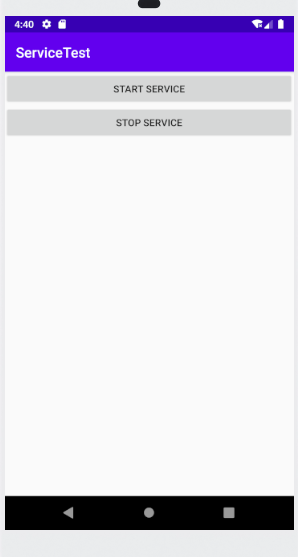
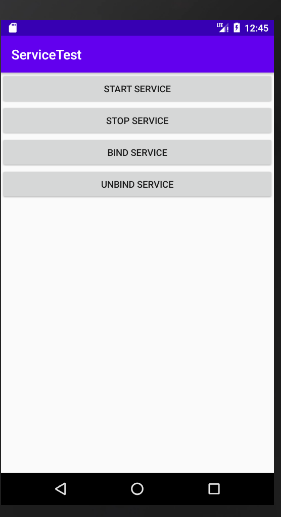
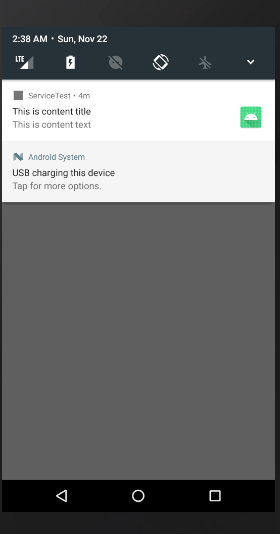
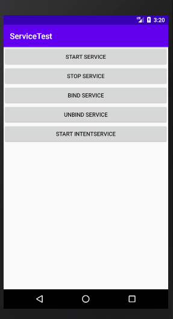

## 1. 服务
```markdown
服务（Service ）是Android中实现程序后台运行的解决方案，它非常适合去执行那些不需要 和用户交互而且还要求长期运行的任务。服务的运行不依赖于任何用户界面，即使程序被切换到 后台，或者用户打开了另外一个应用程序，服务仍然能够保持正常运行。
不过需要注意的是，服务并不是运行在一个独立的进程当中的，而是依赖于创建服务时所在 的应用程序进程。当某个应用程序进程被杀掉时，所有依赖于该进程的服务也会停止运行。
```
### 1.1 在子线程中更新UI
```markdown
和许多其他的GUI库一样，Android的UI也是线程不安全的。也就是说，如果想要更新应 用程序里的UI元素，则必须在主线程中进行，否则就会出现异常。
```
* activity_main.xml
```xml
<?xml version="1.0" encoding="utf-8"?>
<androidx.constraintlayout.widget.ConstraintLayout xmlns:android="http://schemas.android.com/apk/res/android"
    xmlns:app="http://schemas.android.com/apk/res-auto"
    xmlns:tools="http://schemas.android.com/tools"
    android:layout_width="match_parent"
    android:layout_height="match_parent"
    tools:context=".MainActivity">

   <RelativeLayout
       android:layout_width="match_parent"
       android:layout_height="match_parent"
       >
       <Button
           android:id="@+id/change_text"
           android:layout_width="match_parent"
           android:layout_height="wrap_content"
           android:text="Change Text">

       </Button>

       <TextView
           android:id="@+id/text"
           android:layout_width="wrap_content"
           android:layout_height="wrap_content"
           android:layout_centerInParent="true"
           android:text="Hello world"
           android:textSize="20sp"
           >

       </TextView>
   </RelativeLayout>

</androidx.constraintlayout.widget.ConstraintLayout>
```
* MainActivity

```java
package com.yxj.androidthreadtest;

import androidx.appcompat.app.AppCompatActivity;

import android.os.Bundle;
import android.os.Handler;
import android.os.Message;
import android.view.View;
import android.widget.Button;
import android.widget.TextView;

public class MainActivity extends AppCompatActivity implements View.OnClickListener{

    private TextView text;


    @Override
    protected void onCreate(Bundle savedInstanceState) {
        super.onCreate(savedInstanceState);
        setContentView(R.layout.activity_main);
        text = (TextView) findViewById(R.id.text);
        Button changeText = (Button) findViewById(R.id.change_text);
        changeText.setOnClickListener(this);
    }

    @Override
    public void onClick(View v) {
        switch (v.getId()){
            case R.id.change_text:
                new Thread(new Runnable() {
                    @Override
                    public void run() {
                       text.setText("Nice to meet you");
                    }
                }).start();
                break;
            default:
                break;
        }
    }
}
```


```markdown
对于这种情况，Android提供了一套异步消息处理机制，完美地解决了在子线程中进行UI 操作的问题。
```
* MainActivity
```java
package com.yxj.androidthreadtest;

import android.os.Bundle;
import android.os.Handler;
import android.os.Message;
import android.view.View;
import android.widget.Button;
import android.widget.TextView;

import androidx.appcompat.app.AppCompatActivity;

public class MainActivity extends AppCompatActivity implements View.OnClickListener{

    public static final int UPDATE_TEXT = 1;
    private TextView text;

    private Handler handler = new Handler(){
        public void handleMessage(Message msg){
            switch (msg.what){
                case UPDATE_TEXT:
                    text.setText("Nice to meet you");
                    break;
                default:
                    break;
            }
        }
    };
    @Override
    protected void onCreate(Bundle savedInstanceState) {
        super.onCreate(savedInstanceState);
        setContentView(R.layout.activity_main);
        text = (TextView) findViewById(R.id.text);
        Button changeText = (Button) findViewById(R.id.change_text);
        changeText.setOnClickListener(this);
    }

    @Override
    public void onClick(View v) {
        switch (v.getId()){
            case R.id.change_text:
                new Thread(new Runnable() {
                    @Override
                    public void run() {
                        Message message = new Message();
                        message.what = UPDATE_TEXT;
                        handler.sendMessage(message);
                    }
                }).start();
                break;
            default:
                break;
        }
    }
}
```
```markdown
现在重新运行程序，可以看到屏幕的正中央显示着Hello worldo然后点这里我们先是定义了一个整型常量UPDATE_TEXT,用于表示更新TextView这个动作。然后 新增一个Handler对象，并重写父类的handleMessage()方法，在这里对具体的Message进行 处理。如果发现Message的what字段的值等于UPDATE_TEXT,就将TextView显示的内容改成 Nice to meet you
下面再来看一下Change Text按钮的点击事件中的代码。可以看到，这次我们并没有在子线 程里直接进行UI操作，而是创建了一个Message( android.os .Message )对象，并将它的what 字段的值指定为UPDATE_TEXT,然后调用Handler的sendMessage()方法将这条Message发送 出去。很快，Handler就会收到这条Message,并在handleMessage()方法中对它进行处理。注 意此时handleMessage()方法中的代码就是在主线程当中运行的了，所以我们可以放心地在这 里进行UI操作。接下来对Message携带的what字段的值进行判断，如果等于UPDATE_TEXT, 就将TextView显示的内容改成Nice to meet youo

```

```markdown

```

### 1.2 在子线程中更新UI解析异步消息处理机制
```markdown
Android中的异步消息处理主要由4个部分组成:Message、Handler、MessageQueue和Loopero.
1.	Message
Message是在线程之间传递的消息，它可以在内部携带少量的信息，用于在不同线程之间交 换数据。我们使用到了 Message的what字段，除此之外还可以使用argl和arg2字 段来携带一些整型数据，使用obj字段携带一个Object对象。
2.	Handler
Handler顾名思义也就是处理者的意思，它主要是用于发送和处理消息的。发送消息一般是 使用Handler的sendMessage()方法，而发岀的消息经过一系列地辗转处理后，最终会传递到 Handler 的 handleMessage()方法中。
3.	MessageQueue
MessageQueue是消息队列的意思，它主要用于存放所有通过Handler发送的消息°这部分消 息会一直存在于消息队列中，等待被处理。每个线程中只会有一个MessageQueue对象。
4.	Looper
Looper是每个线程中的MessageQueue的管家，调用Looper的loop()方法后，就会进入到 一个无限循环当中，然后每当发现MessageQueue中存在一条消息，就会将它取出，并传递到 Handler的handleMessage()方法中。每个线程中也只会有一个Looper对象。
了解了 Message. Handler. MessageQueue以及Looper的基本概念后，我们再来把异步消息 处理的整个流程梳理一遍。首先需要在主线程当中创建一个Handler对象，并重写 handleMessage()方法。然后当子线程中需要进行UI操作时，就创建一个Message对象，并通 过Handler将这条消息发送出去。之后这条消息会被添加到MessageQueue的队列中等待被处理, 而Looper则会一直尝试从MessageQueue中取岀待处理消息，最后分发回Handler的 handleMessage()方法中。由于Handler是在主线程中创建的，所以此时handleMessage()方 法中的代码也会在主线程中运行，于是我们在这里就可以安心地进行UI操作了。

```


### 1.3 服务的基本用法
#### 1.3.1 服务的基本用法
* MyService
```java
package com.yxj.servicetest;

import android.app.Service;
import android.content.Intent;
import android.os.IBinder;
import android.util.Log;

public class MyService extends Service {
    private static final String TAG = "MyService";
    public MyService() {
    }

    @Override
    public void onCreate() {
        super.onCreate();
    }

    @Override
    public void onStart(Intent intent, int startId) {
        super.onStart(intent, startId);
    }

    @Override
    public void onDestroy() {
        super.onDestroy();
    }

    @Override
    public IBinder onBind(Intent intent) {
        // TODO: Return the communication channel to the service.
        throw new UnsupportedOperationException("Not yet implemented");
    }
}

```
```markdown
重写了 onCreate()、onStartCommand()和onDestroy()这3个方 法，它们是每个服务中最常用到的3个方法了。其中onCreate()方法会在服务创建的时候调用, onStartCommand()方法会在每次服务启动的时候调用，onDestroy()方法会在服务销毁的时候 调用。
通常情况下，如果我们希望服务一旦启动就立刻去执行某个动作，就可以将逻辑写在 onStartCommand()方法里。而当服务销毁时，我们又应该在onDestroy ()方法中去回收那些不 再使用的资源。
另外需要注意，每一个服务都需要在AndroidManifest.xml文件中进行注册才能生效，打开AndroidManifest.xml文件瞧一瞧，代码如下所示：
```
* AndroidManifest.xml
```xml
<?xml version="1.0" encoding="utf-8"?>
<manifest xmlns:android="http://schemas.android.com/apk/res/android"
    package="com.yxj.servicetest">

    <application
        android:allowBackup="true"
        android:icon="@mipmap/ic_launcher"
        android:label="@string/app_name"
        android:roundIcon="@mipmap/ic_launcher_round"
        android:supportsRtl="true"
        android:theme="@style/AppTheme">
        <!-- Exported属性表示是否允许除了当前程序之外的其他程序访问这个服务,Enabled属性表示是否启用这个服务-->
        <service
            android:name=".MyService"
            android:enabled="true"
            android:exported="true"></service>

        <activity android:name=".MainActivity">
            <intent-filter>
                <action android:name="android.intent.action.MAIN" />

                <category android:name="android.intent.category.LAUNCHER" />
            </intent-filter>
        </activity>
    </application>

</manifest>
```
#### 1.3.2 启动和停止服务
* activity_main.xml
```xml
<?xml version="1.0" encoding="utf-8"?>
<androidx.constraintlayout.widget.ConstraintLayout xmlns:android="http://schemas.android.com/apk/res/android"
    xmlns:app="http://schemas.android.com/apk/res-auto"
    xmlns:tools="http://schemas.android.com/tools"
    android:layout_width="match_parent"
    android:layout_height="match_parent"
    tools:context=".MainActivity">

    <LinearLayout
        android:layout_width="match_parent"
        android:layout_height="match_parent"
        android:orientation="vertical"
        >

        <Button
            android:id="@+id/start_service"
            android:layout_width="match_parent"
            android:layout_height="wrap_content"
            android:text="Start Service">

        </Button>

        <Button
            android:id="@+id/stop_service"
            android:layout_width="match_parent"
            android:layout_height="wrap_content"
            android:text="Stop Service">

        </Button>

    </LinearLayout>


</androidx.constraintlayout.widget.ConstraintLayout>
```
* MainActivity
```java
package com.yxj.servicetest;

import androidx.appcompat.app.AppCompatActivity;

import android.content.Intent;
import android.os.Bundle;
import android.view.View;
import android.widget.Button;

public class MainActivity extends AppCompatActivity implements View.OnClickListener {

    @Override
    protected void onCreate(Bundle savedInstanceState) {
        super.onCreate(savedInstanceState);
        setContentView(R.layout.activity_main);
        Button startService = (Button) findViewById(R.id.start_service);
        Button stopService = (Button) findViewById(R.id.stop_service);
        startService.setOnClickListener(this);
        stopService.setOnClickListener(this);


    }

    @Override
    public void onClick(View v) {
        switch (v.getId()){
            case R.id.start_service:
                Intent startIntent = new Intent(this, MyService.class);
                startService(startIntent);
                break;
            case R.id.stop_service:
                Intent stopIntent = new Intent(this, MyService.class);
                stopService(stopIntent);
                break;
            default:
                break;

        }
    }
}
```
```markdown
可以看到，这里在onCreate()方法中分别获取到了 Start Service按钮和Stop Service按钮的 实例，并给它们注册了点击事件。然后在Start Service按钮的点击事件里，我们构建出了一个 Intent对象，并调用startService()方法来启动MyService这个服务。在Stop Serivce按钮的 点击事件里，我们同样构建出了一个Intent对象,并调用stopService()方法来停止MyService 这个服务。startService()和stopService()方法都是定义在Context类中的，所以我们在 活动里可以直接调用这两个方法。注意，这里完全是由活动来决定服务何时停止的，如果没有点 击Stop Service按钮，服务就会一直处于运行状态。那服务有没有什么办法让自已停止下来呢？ 当然可以，只需要在MyService的任何一个位置调用stopSelf()方法就能让这个服务停止下来了。
```

```markdown
证实服务已经成功启动或者停止了呢？ 最简单的方法就是在MyService的几个方法中加入打印日志，如下所示：
```
* MyService
```java
package com.yxj.servicetest;

import android.app.Service;
import android.content.Intent;
import android.os.IBinder;
import android.util.Log;

public class MyService extends Service {
    private static final String TAG = "MyService";
    public MyService() {
    }

    @Override
    public void onCreate() {
        super.onCreate();
        Log.d(TAG, "onCreate executed");
    }

    @Override
    public int onStartCommand(Intent intent, int flags, int startId) {
        Log.d(TAG, "onStartCommand executed");
        return super.onStartCommand(intent, flags, startId);
    }

    @Override
    public void onDestroy() {
        super.onDestroy();
        Log.d(TAG, "onDestroy executed");
    }

    @Override
    public IBinder onBind(Intent intent) {
        // TODO: Return the communication channel to the service.
        throw new UnsupportedOperationException("Not yet implemented");
    }
}

```



```markdown
其实onCreate()方法是在服务第一次创建的时候调用的，而onStartCommand()方法则在 每次启动服务的时候都会调用，由于刚才我们是第一次点击Start Service按钮，服务此时还未创 建过，所以两个方法都会执行，之后如果你再连续多点击几次Start Service按钮，你就会发现只有onStartCommand()方法可以得到执行了。
```
#### 1.3.3 活动和服务进行通信
```markdown
不知道你有没有发现，虽然服务是在活动里 启动的，但在启动了服务之后，活动与服务基本就没有什么关系了。确实如此，我们在活动里调 用了 startService()方法来启动 MyService 这个服务，然后 MyService 的 onCreate() 和 onStartCommand()方法就会得到执行。之后服务会一直处于运行状态，但具体运行的是什么逻 辑，活动就控制不了了。这就类似于活动通知了服务一下：“你可以启动了！”然后服务就去忙自 己的事情了，但活动并不知道服务到底去做了什么事情，以及完成得如何。
那么有没有什么办法能让活动和服务的关系更紧密一些呢？例如在活动中指挥服务去干什 么，服务就去干什么。当然可以，这就需要借助我们刚刚忽略的onBind()方法了。

```

```markdown
比如说，目前我们希望在MyService里提供一个下载功能，然后在活动中可以决定何时开始 下载，以及随时查看下载进度。实现这个功能的思路是创建一个专门的Binder对象来对下载功能进行管理,修改MyService中的代码
```
* MyService
```java
package com.yxj.servicetest;

import android.app.Service;
import android.content.Intent;
import android.os.Binder;
import android.os.IBinder;
import android.util.Log;

public class MyService extends Service {
    private static final String TAG = "MyService";
    private DownloadBinder mBinder = new DownloadBinder();
    public MyService() {
    }

    @Override
    public void onCreate() {
        super.onCreate();
        Log.d(TAG, "onCreate executed");
    }

    @Override
    public int onStartCommand(Intent intent, int flags, int startId) {
        Log.d(TAG, "onStartCommand executed");
        return super.onStartCommand(intent, flags, startId);
    }

    @Override
    public void onDestroy() {
        super.onDestroy();
        Log.d(TAG, "onDestroy executed");
    }

    @Override
    public IBinder onBind(Intent intent) {
         return mBinder;
    }

    class DownloadBinder extends Binder {
        public void startDownload() {
            Log.d(TAG, "startDownload executed");
        }

        public int getProgress() {
            Log.d(TAG, "getProgress executed");
            return 0;
        }

    }

}

```
```markdown
可以看到，这里我们新建了一个DownloadBinder类，并让它继承自Binder,然后在它的 内部提供了开始下载以及查看下载进度的方法。当然这只是两个模拟方法，并没有实现真正的功 能,我们在这两个方法中分别打印了一行日志。
接着，在MyService中创建了 DownloadBinder的实例，然后在onBind()方法里返回了这个 实例，这样MyService中的工作就全部完成了。

```
* MainActivity
```java
package com.yxj.servicetest;

import androidx.appcompat.app.AppCompatActivity;

import android.content.ComponentName;
import android.content.Intent;
import android.content.ServiceConnection;
import android.os.Bundle;
import android.os.IBinder;
import android.view.View;
import android.widget.Button;

public class MainActivity extends AppCompatActivity implements View.OnClickListener {

    private MyService.DownloadBinder downloadBinder;

    private ServiceConnection  connection = new ServiceConnection() {
        @Override
        public void onServiceConnected(ComponentName name, IBinder service) {
             downloadBinder = (MyService.DownloadBinder) service;
             downloadBinder.startDownload();
             downloadBinder.getProgress();
        }

        @Override
        public void onServiceDisconnected(ComponentName name) {

        }
    };

    @Override
    protected void onCreate(Bundle savedInstanceState) {
        super.onCreate(savedInstanceState);
        setContentView(R.layout.activity_main);
        Button startService = (Button) findViewById(R.id.start_service);
        Button stopService = (Button) findViewById(R.id.stop_service);
        startService.setOnClickListener(this);
        stopService.setOnClickListener(this);
        Button bindService = (Button) findViewById(R.id.bind_service);
        Button unbindService = (Button) findViewById(R.id.unbind_service);
        bindService.setOnClickListener(this);
        unbindService.setOnClickListener(this);
    }


    @Override
    public void onClick(View v) {
        switch (v.getId()){
            case R.id.start_service:
                Intent startIntent = new Intent(this, MyService.class);
                startService(startIntent);
                break;
            case R.id.stop_service:
                Intent stopIntent = new Intent(this, MyService.class);
                stopService(stopIntent);
                break;

            case R.id.bind_service:
                Intent bindIntent = new Intent(this, MyService.class);
                bindService(bindIntent,connection,BIND_AUTO_CREATE); // 绑定服务
                break;

            case R.id.unbind_service:
                unbindService(connection);  // 解绑服务
                break;
            default:
                break;

        }
    }
}
```
```markdown
可以看到，这里我们首先创建了一个Serviceconnection的匿名类，在里面重写了 onServiceConnected ()方法和onSen/iceDisconnected()方法，这两个方法分别会在活动与 服务成功绑定以及解除绑定的时候调用。在onServiceConnected ()方法中，我们又通过向下转 型得到了 DownloadBinder的实例，有了这个实例，活动和服务之间的关系就变得非常紧密了。 现在我们可以在活动中根据具体的场景来调用DownloadBinder中的任何public()方法，即实 现了指挥服务干什么服务就去干什么的功能。这里仍然只是做了个简单的测试，在onServiceConnected()方法中调用了 DownloadBinder 的 startDownload()和 getProgress()方法。
当然，现在活动和服务其实还没进行绑定呢，这个功能是在Bind Service按钮的点击事件里 完成的。可以看到，这里我们仍然是构建出了一个Intent对象，然后调用bindService()方法 将MainActivity和MyService进行绑定。bindService()方法接收3个参数，第一个参数就是刚 刚构建岀的Intent对象，第二个参数是前面创建出的ServiceConnection的实例，第三个参数则 是一个标志位，这里传入BIND_AUTO_CREATE表示在活动和服务进行绑定后自动创建服务。这会使得MyService中的onCreate()方法得到执行，但onStartCommand()方法不会执行。
然后如果我们想解除活动和服务之间的绑定该怎么办呢？调用一下unbindService()方法 就可以了，这也是Unbind Service按钮的点击事件里实现的功能。


可以看到，首先是MyService的onCreate()方法得到了执行，然后startDownload()和 getProgress()方法都得到了执行，说明我们确实已经在活动里成功调用了服务里提供的方法了。
另外需要注意，任何一个服务在整个应用程序范围内都是通用的，即MyService不仅可以和 MainActivity绑定，还可以和任何一个其他的活动进行绑定，而且在绑定完成后它们都可以获取 到相同的DownloadBinder实例。
```


#### 1.3.4 服务的生命周期
```markdown
服务也有自己的生命周期，前面我们 使用到的 onCreate()、onStartCommand()、onBind()和 onDestroy()等方法都是在服务的生 命周期内可能回调的方法。
一旦在项目的任何位置调用了 Context的startServiceO方法，相应的服务就会启动起来， 并回调onStartCommand()方法。如果这个服务之前还没有创建过，onCreate()方法会先于 onStartCommand()方法执行。服务启动了之后会一直保持运行状态，直到stopService()或 stopSelf ()方法被调用。注意，虽然每调用一次startServic()方法，onStartCommand()就 会执行一次，但实际上每个服务都只会存在一个实例。所以不管你调用了多少次startServiceO 方法，只需调用一次stopService()或stopSelf ()方法，服务就会停止下来了。
另外，还可以调用Context的bindSevice()来获取一个服务的持久连接，这时就会回调服 务中的onBind()方法。类似地，如果这个服务之前还没有创建过，onCreate()方法会先于 onBind()方法执行。之后，调用方可以获取到onBind()方法里返回的IBinder对象的实例， 这样就能自由地和服务进行通信了。只要调用方和服务之间的连接没有断开，服务就会一直保持 运行状态。
当调用了 startService()方法后，又去调用stopServiceO方法，这时服务中的 onDestroy()方法就会执行，表示服务已经销毁了。类似地，当调用了 bindService()方法后， 又去调用unbindServicef)方法，onDestroy()方法也会执行，这两种情况都很好理解。但是 需要注意，我们是完全有可能对一个服务既调用了 startServiceO方法，又调用了 bindServiceO方法的，这种情况下该如何才能让服务销毁掉呢？根据Android系统的机制，一 个服务只要被启动或者被绑定了之后，就会一直处于运行状态，必须要让以上两种条件同时不满 足，服务才能被销毁。所以，这种情况下要同时调用stopServiceO和unbindService()方法， onDestroyO方法才会执行。这样你就已经把服务的生命周期完整地走了一遍。

```
#### 1.3.5 服务的更多技巧
##### 1.3.5.1 使用前台服务
```markdown
服务几乎都是在后台运行的，一直以来它都是默默地做着辛苦的工作。但是服务的系统优先 级还是比较低的，当系统出现内存不足的情况时，就有可能会回收掉正在后台运行的服务。如果 你希望服务可以一直保持运行状态，而不会由于系统内存不足的原因导致被回收，就可以考虑使 用前台服务。前台服务和普通服务最大的区别就在于，它会一直有一个正在运行的图标在系统的 状态栏显示，下拉状态栏后可以看到更加详细的信息，非常类似于通知的效果。
```
* 创建一个前台服务
* MyService
```java
package com.yxj.servicetest;

import android.app.Notification;
import android.app.PendingIntent;
import android.app.Service;
import android.content.Intent;
import android.graphics.BitmapFactory;
import android.os.Binder;
import android.os.IBinder;
import android.util.Log;

import androidx.core.app.NotificationCompat;

import java.time.temporal.ValueRange;

public class MyService extends Service {
    private static final String TAG = "MyService";
    private DownloadBinder mBinder = new DownloadBinder();
    public MyService() {
    }

    @Override
    public void onCreate() {
        super.onCreate();
        Log.d(TAG, "onCreate executed");
        Intent intent = new Intent(this, MainActivity.class);
        PendingIntent pi = PendingIntent.getActivity(this, 0, intent, 0);
        Notification notification = new NotificationCompat.Builder(this)
                .setContentTitle("This is content title")
                .setContentText("This is content text")
                .setWhen(System.currentTimeMillis())
                .setSmallIcon(R.mipmap.ic_launcher)
                .setLargeIcon(BitmapFactory.decodeResource(getResources(),R.mipmap.ic_launcher))
                .setContentIntent(pi)
                .build();
        startForeground(1,notification);


    }

    @Override
    public int onStartCommand(Intent intent, int flags, int startId) {
        Log.d(TAG, "onStartCommand executed");
        return super.onStartCommand(intent, flags, startId);
    }

    @Override
    public void onDestroy() {
        super.onDestroy();
        Log.d(TAG, "onDestroy executed");
    }

    @Override
    public IBinder onBind(Intent intent) {
         return mBinder;
    }

    class DownloadBinder extends Binder {
        public void startDownload() {
            Log.d(TAG, "startDownload executed");
        }

        public int getProgress() {
            Log.d(TAG, "getProgress executed");
            return 0;
        }

    }

}

```

* MainActivity
```java
package com.yxj.servicetest;

import androidx.appcompat.app.AppCompatActivity;

import android.content.ComponentName;
import android.content.Intent;
import android.content.ServiceConnection;
import android.os.Bundle;
import android.os.IBinder;
import android.view.View;
import android.widget.Button;

public class MainActivity extends AppCompatActivity implements View.OnClickListener {

    private MyService.DownloadBinder downloadBinder;

    private ServiceConnection  connection = new ServiceConnection() {
        @Override
        public void onServiceConnected(ComponentName name, IBinder service) {
             downloadBinder = (MyService.DownloadBinder) service;
             downloadBinder.startDownload();
             downloadBinder.getProgress();
        }

        @Override
        public void onServiceDisconnected(ComponentName name) {

        }
    };

    @Override
    protected void onCreate(Bundle savedInstanceState) {
        super.onCreate(savedInstanceState);
        setContentView(R.layout.activity_main);
        Button startService = (Button) findViewById(R.id.start_service);
        Button stopService = (Button) findViewById(R.id.stop_service);
        startService.setOnClickListener(this);
        stopService.setOnClickListener(this);
        Button bindService = (Button) findViewById(R.id.bind_service);
        Button unbindService = (Button) findViewById(R.id.unbind_service);
        bindService.setOnClickListener(this);
        unbindService.setOnClickListener(this);
    }


    @Override
    public void onClick(View v) {
        switch (v.getId()){
            case R.id.start_service:
                Intent startIntent = new Intent(this, MyService.class);
                startService(startIntent);
                break;
            case R.id.stop_service:
                Intent stopIntent = new Intent(this, MyService.class);
                stopService(stopIntent);
                break;

            case R.id.bind_service:
                Intent bindIntent = new Intent(this, MyService.class);
                bindService(bindIntent,connection,BIND_AUTO_CREATE); // 绑定服务
                break;

            case R.id.unbind_service:
                unbindService(connection);  // 解绑服务
                break;
            default:
                break;

        }
    }
}
```
```markdown
这次在构建出Notification对象后 并没有使用NotificationManager来将通知显示出来，而是调用了 startForeground()方法。这 个方法接收两个参数，第一个参数是通知的id,类似于notify()方法的第一个参数，第二个参 数则是构建出的Notification对象。调用startForeground()方法后就会让MyService变成 一个前台服务，并在系统状态栏显示出来。
现在重新运行一下程序，并点击Start Service或Bind Service按钮，MyService就会以前台服 务的模式启动了，并且在系统状态栏会显示一个通知图标，下拉状态栏后可以看到该通知的详细 内容.

```


##### 1.3.5.2 使用 IntentService
```markdown
话说回来，在本章一开始的时候我们就已经知道，服务中的代码都是默认运行在主线程当中 的，如果直接在服务里去处理一些耗时的逻辑，就很容易出现ANR ( Application Not Responding ) 的情况。
所以这个时候就需要用到Android多线程编程的技术了，我们应该在服务的每个具体的方法 里开启一个子线程，然后在这里去处理那些耗时的逻辑。因此，一个比较标准的服务就可以写成 如下形式：
public class MyService extends Service {
@Override
public int onStartCommand(Intent intent, int flags, int startld) {
new Thread(new Runnable() {
@Override
public void run() {
//处理具体的逻辑
}
}).start();
return super.onStartCommand(intent, flags, startld);
}
}


但是，这种服务一旦启动之后，就会一直处于运行状态，必须调用stopServiceO或者 stopSelf ()方法才能让服务停止下来。所以，如果想要实现让一个服务在执行完毕后自动停止的功能，就可以这样写：
public class MyService extends Service {
@Override
public int onStartCommand(Intent intent, int flags, int startld) { new Th read(new Runnable() {
@Override 
public void run() {
//处理具体的逻辑 stopSelf();
}
}),start();
return super.onStartCommand(intent, flags, startld);
}
}
虽说这种写法并不复杂，但是总会有一些程序员忘记开启线程，或者忘记调用stopSelf () 方法。为了可以简单地创建一个异步的、会自动停止的服务，Android专门提供了一个 Intentservice类
这里首先要提供一个无参的构造函数，并且必须在其内部调用父类的有参构造函数。然后要 在子类中去实现onHandlelntent ()这个抽象方法，在这个方法中可以去处理一些具体的逻辑， 而且不用担心ANR的问题，因为这个方法已经是在子线程中运行的了。这里为了证实一下，我 们在onHandleIntent()方法中打印了当前线程的id。另外根据Intentservice的特性，这个 服务在运行结束后应该是会自动停止的，所以我们又重写了 onDestroy。方法，在这里也打印 了一行日志，以证实服务是不是停止掉了。
```
* MyIntentService
```java
package com.yxj.servicetest;

import android.app.IntentService;
import android.content.Intent;
import android.util.Log;

import androidx.annotation.Nullable;

public class MyIntentService extends IntentService {
    private static final String TAG = "MyIntentService";

    public MyIntentService() {
        super("MyIntentService");
    }

    @Override
    protected void onHandleIntent(@Nullable Intent intent) {
        Log.d(TAG, "Thread id is " + Thread.currentThread().getId());
    }

    @Override
    public void onDestroy() {
        super.onDestroy();
        Log.d(TAG, "onDestroy executed");
    }
}

```
* activity_main.xml
```xml
<?xml version="1.0" encoding="utf-8"?>
<androidx.constraintlayout.widget.ConstraintLayout xmlns:android="http://schemas.android.com/apk/res/android"
    xmlns:app="http://schemas.android.com/apk/res-auto"
    xmlns:tools="http://schemas.android.com/tools"
    android:layout_width="match_parent"
    android:layout_height="match_parent"
    tools:context=".MainActivity">

    <LinearLayout
        android:layout_width="match_parent"
        android:layout_height="match_parent"
        android:orientation="vertical"
        >

        <Button
            android:id="@+id/start_service"
            android:layout_width="match_parent"
            android:layout_height="wrap_content"
            android:text="Start Service">

        </Button>

        <Button
            android:id="@+id/stop_service"
            android:layout_width="match_parent"
            android:layout_height="wrap_content"
            android:text="Stop Service">

        </Button>

        <Button
            android:id="@+id/bind_service"
            android:layout_width="match_parent"
            android:layout_height="wrap_content"
            android:text="Bind Service"
            >

        </Button>

        <Button
            android:id="@+id/unbind_service"
            android:layout_width="match_parent"
            android:layout_height="wrap_content"
            android:text="Unbind Service">

        </Button>

        <Button
            android:id="@+id/start_intent_service"
            android:layout_width="match_parent"
            android:layout_height="wrap_content"
            android:text="Start IntentService">

        </Button>

    </LinearLayout>


</androidx.constraintlayout.widget.ConstraintLayout>
```
* MainActivity
```java
package com.yxj.servicetest;

import androidx.appcompat.app.AppCompatActivity;

import android.content.ComponentName;
import android.content.Intent;
import android.content.ServiceConnection;
import android.os.Bundle;
import android.os.IBinder;
import android.util.Log;
import android.view.View;
import android.widget.Button;

import java.time.temporal.ValueRange;

public class MainActivity extends AppCompatActivity implements View.OnClickListener {

    private MyService.DownloadBinder downloadBinder;
    private static final String TAG = "MainActivity";
    private ServiceConnection  connection = new ServiceConnection() {
        @Override
        public void onServiceConnected(ComponentName name, IBinder service) {
             downloadBinder = (MyService.DownloadBinder) service;
             downloadBinder.startDownload();
             downloadBinder.getProgress();
        }

        @Override
        public void onServiceDisconnected(ComponentName name) {

        }
    };

    @Override
    protected void onCreate(Bundle savedInstanceState) {
        super.onCreate(savedInstanceState);
        setContentView(R.layout.activity_main);
        Button startService = (Button) findViewById(R.id.start_service);
        Button stopService = (Button) findViewById(R.id.stop_service);
        startService.setOnClickListener(this);
        stopService.setOnClickListener(this);
        Button bindService = (Button) findViewById(R.id.bind_service);
        Button unbindService = (Button) findViewById(R.id.unbind_service);
        bindService.setOnClickListener(this);
        unbindService.setOnClickListener(this);
        Button startIntentService = (Button) findViewById(R.id.start_intent_service);
        startIntentService.setOnClickListener(this);
    }


    @Override
    public void onClick(View v) {
        switch (v.getId()){
            case R.id.start_service:
                Intent startIntent = new Intent(this, MyService.class);
                startService(startIntent);
                break;
            case R.id.stop_service:
                Intent stopIntent = new Intent(this, MyService.class);
                stopService(stopIntent);
                break;

            case R.id.bind_service:
                Intent bindIntent = new Intent(this, MyService.class);
                bindService(bindIntent,connection,BIND_AUTO_CREATE); // 绑定服务
                break;

            case R.id.unbind_service:
                unbindService(connection);  // 解绑服务
                break;
            case R.id.start_intent_service:
                Log.d(TAG, "Thread id is " + Thread.currentThread().getId());
                Intent intentService = new Intent(this, MyIntentService.class);
                startService(intentService);
                break;
            default:
                break;

        }
    }
}
```
```markdown
最后不要忘记，服务都是需要在AndroidManifest.xml里注册
```
* AndroidManifest.xml
```xml
<?xml version="1.0" encoding="utf-8"?>
<manifest xmlns:android="http://schemas.android.com/apk/res/android"
    package="com.yxj.servicetest">

    <application
        android:allowBackup="true"
        android:icon="@mipmap/ic_launcher"
        android:label="@string/app_name"
        android:roundIcon="@mipmap/ic_launcher_round"
        android:supportsRtl="true"
        android:theme="@style/AppTheme">
        <service
            android:name=".MyService"
            android:enabled="true"
            android:exported="true">

        </service>
        <service android:name=".MyIntentService">

        </service>
        <activity android:name=".MainActivity">
            <intent-filter>
                <action android:name="android.intent.action.MAIN" />

                <category android:name="android.intent.category.LAUNCHER" />
            </intent-filter>
        </activity>
    </application>

</manifest>
```



```markdown
可以看到，不仅MylntentService和MainActivity所在的线程id不一样，而且onDestroy() 方法也得到了执行，说明MylntentService在运行完毕后确实自动停止了。集开启线程和自动停 止于一身.
```