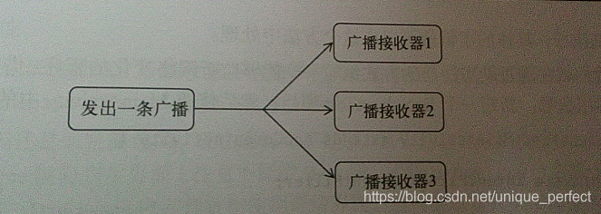

## 1.广播机制
### 1.1标准广播
```markdown
标准广播(Normal broadcasts )是一种完全异步执行的广播，在广播发出之后，所有的广 播接收器几乎都会在同一时刻接收到这条广播消息，因此它们之间没有任何先后顺序可 言。这种广播的效率会比较高，但同时也意味着它是无法被截断的
```


### 1.2 有序广播
```markdown
有序广播(Ordered broadcasts )则是一种同步执行的广播，在广播发出之后，同一时刻只 会有一个广播接收器能够收到这条广播消息，当这个广播接收器中的逻辑执行完毕后， 广播才会继续传递。所以此时的广播接收器是有先后顺序的，优先级高的广播接收器就 可以先收到广播消息，并且前面的广播接收器还可以截断正在传递的广播，这样后面的 广播接收器就无法收到广播消息了
```


### 1.3 接收系统广播
```markdown
Android内置了很多系统级别的广播，我们可以在应用程序中通过监听这些广播来得到各种 系统的状态信息。比如手机开机完成后会发出一条广播，电池的电量发生变化会发出一条广播， 时间或时区发生改变也会发出一条广播，等等。如果想要接收到这些广播，就需要使用广播接收 器，下面我们就来看一下它的具体用法
```
#### 1.3.1 动态注册监听网络变化
```markdown
广播接收器可以自由地对自己感兴趣的广播进行注册，这样当有相应的广播发岀时，广播接 收器就能够收到该广播，并在内部处理相应的逻辑。注册广播的方式一般有两种，在代码中注册 和在AndroidManifest.xml中注册，其中前者也被称为动态注册，后者也被称为静态注册。
```
```markdown
那么该如何创建一个广播接收器呢？其实只需要新建一个类，让它继承自BroadcastReceiver, 并重写父类的onReceiveO方法就行了。这样当有广播到来时，onReceive( )方法 就会得到执行，具体的逻辑就可以在这个方法中处理。
```
* MainActivity.java

```java
package com.yxj.broadcasttest;

import androidx.appcompat.app.AppCompatActivity;

import android.content.BroadcastReceiver;
import android.content.Context;
import android.content.Intent;
import android.content.IntentFilter;
import android.net.ConnectivityManager;
import android.net.NetworkInfo;
import android.os.Bundle;
import android.widget.Toast;

// 可以看到，我们在MainActivity中定义了一个内部类NetworkChangeReceiver,这个类是继承自BroadcastReceiver的，并重写了父类的onReceive()方法。这样每当网络状态发生变化时onReceive ()方法就会得到执行，这里只是简单地使用Toast提示了一段文本信息。然后观察onCreate()方法，首先我们创建了一个IntentFilter的实例，并给它添加了一 个值为android.net.conn.CONNECTIVITY_CHANGE的action,为什么要添加这个值呢？因为当 网络状态发生变化时，系统发出的正是一条值为android.net.conn.CONNECTIVITY_CHANGE的 广播，也就是说我们的广播接收器想要监听什么广播，就在这里添加相应的action接下来创建 了一个NetworkChangeReceiver的实例，然后调用registerReceiver()方法进行注册，将 NetworkChangeReceiver 的实例和 IntentFilter 的实例都传了进去，这样NetworkChangeReceiver 就会收到所有值为android.net.conn.CONNECTIVITY_CHANGE的广播，也就实现了监听网络变化的功能。最后要记得，动态注册的广播接收器一定都要取消注册才行，这里我们是在onDestroyO 方法中通过调用unregisterReceiver()方法来实现的。

//整体来说，代码还是非常简单的，现在运行一下程序。首先你会在注册完成的时候收到一条广播，然后按下Home键回到主界面(注意不能按Back键，否则。onDestroyO方法会执行),接 着打开Settings程序Data usage进入到数据使用详情界面，然后尝试着开关Cellular data按钮来 启动和禁用网络，你就会看到有Toast提醒你网络发生了变化。


// 在 onReceive()方法中，首先通过 getSystemService()方法得到了 ConnectivityManager 的实例，这是一个系统服务类，专门用于管理网络连接的。然后调用它的getActiveNetworkInfo()方法可以得到Networkinfo的实例，接着调用Networkinfo的isAvailable()方法， 就可以判断出当前是否有网络了，最后我们还是通过Toast的方式对用户进行提示。另外，这里有非常重要的一点需要说明，Android系统为了保护用户设备的安全和隐私，做了严格的规定：如果程序需要进行一些对用户来说比较敏感的操作，就必须在配置文件中声明权 限才可以，否则程序将会直接崩溃。比如这里访问系统的网络状态就是需要声明权限的。打开AndroidManifest.xml文件，在里面加入如下权限就可以访问系统网络状态了 ：<uses-permission android:name="android.permission.ACCESS_NETWORK_STATE" />
//现在重新运行程序，然后按下Home >Settings->Data usage,进入到数据使用详情界面, 关闭Cellular data会弹出无网络可用的提示
public class MainActivity extends AppCompatActivity {
    private IntentFilter intentFilter;
    private NetworkChangeReceiver networkChangeReceiver;
    @Override
    protected void onCreate(Bundle savedInstanceState) {
        super.onCreate(savedInstanceState);
        setContentView(R.layout.activity_main);
        intentFilter = new IntentFilter();
        intentFilter.addAction("android.net.conn.CONNECTIVITY_CHANGE");
        networkChangeReceiver = new NetworkChangeReceiver();
        registerReceiver(networkChangeReceiver, intentFilter);
    }

    @Override
    protected void onDestroy() {
        super.onDestroy();
        unregisterReceiver(networkChangeReceiver);
        System.out.println("destroy1111");
    }

    class NetworkChangeReceiver extends BroadcastReceiver {

        @Override
        public void onReceive(Context context, Intent intent) {
            ConnectivityManager connectivityManager = (ConnectivityManager) getSystemService(Context.CONNECTIVITY_SERVICE);
            NetworkInfo networkInfo = connectivityManager.getActiveNetworkInfo();
            if (networkInfo != null && networkInfo.isAvailable()){
                Toast.makeText(context,"network is available",Toast.LENGTH_SHORT).show();
            }else{
                Toast.makeText(context,"network is unavailable",Toast.LENGTH_SHORT).show();
            }
        }
    }
}
```


#### 1.3.2 静态注册实现开机启动
```markdown
动态注册的广播接收器可以自由地控制注册与注销，在灵活性方面有很大的优势，但是它也 存在着一个缺点，即必须要在程序启动之后才能接收到广播，因为注册的逻辑是写在onCreate() 方法中的。那么有没有什么办法可以让程序在未启动的情况下就能接收到广播呢？这就需要使用 静态注册的方式了。
这里我们准备让程序接收一条开机广播，当收到这条广播时就可以在onReceive()方法里 执行相应的逻辑，从而实现开机启动的功能。可以使用Android Studio 的快捷方式来创建一 个广播接收器，右击New Other Broadcast Receiver
```
* AndroidManifest.xml

```xml
<?xml version="1.0" encoding="utf-8"?>
<manifest xmlns:android="http://schemas.android.com/apk/res/android"
    package="com.yxj.broadcasttest">
// 由于Android系统启动完成后会发出一条值为android.permission.RECEIVE_BOOT_COMPLETED的广播，因此我们在<intent-filter>标签里添加了相应的action另外，监听系统开机广播也是需要声明权限的，可以看到，我们使用<uses-permission>标签又加入了一条android.permission.RECEIVE_BOOT_COMPLETED权限。
    <uses-permission android:name="android.permission.ACCESS_NETWORK_STATE" />
    <uses-permission android:name="android.permission.RECEIVE_BOOT_COMPLETED"/>

    <application
        android:allowBackup="true"
        android:icon="@mipmap/ic_launcher"
        android:label="@string/app_name"
        android:roundIcon="@mipmap/ic_launcher_round"
        android:supportsRtl="true"
        android:theme="@style/AppTheme">

        <activity android:name=".MainActivity">
            <intent-filter>
                <action android:name="android.intent.action.MAIN" />

                <category android:name="android.intent.category.LAUNCHER" />
            </intent-filter>
        </activity>

// Exported属性表示是否 允许这个广播接收器接收本程序以外的广播，Enabled属性表示是否启用这个广播接收器
需要注意的是， 不要在onReceive()方法中添加过多的逻辑或者进行任何的耗时操作，因为在广播接收器中是不允许开启线程的，当onReceive()方法运行了较长时间而没有结束时，程序就会报错。因此 广播接收器更多的是扮演一种打开程序其他组件的角色，比如创建一条状态栏通知，或者启动一个服务等
        <receiver
            android:name=".BootCompleteReceiver"
            android:enabled="true"
            android:exported="true">
            <intent-filter>
                <action android:name="android.intent.action.BOOT_COMPLETED"></action>
            </intent-filter>
        </receiver>
    </application>

</manifest>
```
### 1.3.3 发送自定义广播
#### 1.3.3.1发送标准广播
* MyBroadcastReceiver
```java
package com.yxj.broadcasttest;

import android.content.BroadcastReceiver;
import android.content.Context;
import android.content.Intent;
import android.widget.Toast;

public class MyBroadcastReceiver extends BroadcastReceiver {

    @Override
    public void onReceive(Context context, Intent intent) {
        // TODO: This method is called when the BroadcastReceiver is receiving
        // an Intent broadcast.
      Toast.makeText(context,"received in MyBroadcastReceiver",Toast.LENGTH_SHORT).show();
    }
}

```
* AndroidManifest.xml
```xml
<?xml version="1.0" encoding="utf-8"?>
<manifest xmlns:android="http://schemas.android.com/apk/res/android"
    package="com.yxj.broadcasttest">

    <application
        android:allowBackup="true"
        android:icon="@mipmap/ic_launcher"
        android:label="@string/app_name"
        android:roundIcon="@mipmap/ic_launcher_round"
        android:supportsRtl="true"
        android:theme="@style/AppTheme">
        <receiver
            android:name=".MyBroadcastReceiver"
            android:enabled="true"
            android:exported="true">
            <intent-filter>
                <action android:name="com.yxj.broadcasttest.MY_BROADCAST"></action>
            </intent-filter>
        </receiver>

        <activity android:name=".MainActivity">
            <intent-filter>
                <action android:name="android.intent.action.MAIN" />

                <category android:name="android.intent.category.LAUNCHER" />
            </intent-filter>
        </activity>
    </application>

</manifest>
```
* MainActivity.java

```java
package com.yxj.broadcasttest;

import androidx.appcompat.app.AppCompatActivity;

import android.content.BroadcastReceiver;
import android.content.Context;
import android.content.Intent;
import android.content.IntentFilter;
import android.net.ConnectivityManager;
import android.net.NetworkInfo;
import android.os.Bundle;
import android.view.View;
import android.widget.Button;
import android.widget.Toast;

public class MainActivity extends AppCompatActivity {
    private IntentFilter intentFilter;
    @Override
    protected void onCreate(Bundle savedInstanceState) {
        super.onCreate(savedInstanceState);
        setContentView(R.layout.activity_main);
        Button button = (Button) findViewById(R.id.button);
        button.setOnClickListener(new View.OnClickListener() {
            @Override
            public void onClick(View v) {
                Intent intent = new Intent("com.yxj.broadcasttest.MY_BROADCAST");
                sendBroadcast(intent);
            }
        });
    }


}
```
* activity_main.xml

```xml
<?xml version="1.0" encoding="utf-8"?>
<androidx.constraintlayout.widget.ConstraintLayout xmlns:android="http://schemas.android.com/apk/res/android"
    xmlns:app="http://schemas.android.com/apk/res-auto"
    xmlns:tools="http://schemas.android.com/tools"
    android:layout_width="match_parent"
    android:layout_height="match_parent"
    tools:context=".MainActivity">

    <Button
        android:id="@+id/button"
        android:layout_width="wrap_content"
        android:layout_height="wrap_content"
        android:text="Send Broadcast">

    </Button>
</androidx.constraintlayout.widget.ConstraintLayout>
```

#### 1.3.3.2发送有序广播

```markdown
广播是一种可以跨进程的通信方式，这一点从前面接收系统广播的时候就可以看岀来了。因 此在我们应用程序内发出的广播，其他的应用程序应该也是可以收到的。为了验证这一点，我们 需要再新建一个 BroadcastTest2 项目，点击 Android Studio 导航栏一>File—>New—>New Project 进行 创建。
将项目创建好之后，还需要在这个项目下定义一个广播接收器，用于接收上一小节中的自定 义广播。新建AnotherBroadcastReceiver,代码如下所示：

```
* AnotherBroadcastReceiver.java

```java
package com.yxj.broadcasttest2;

import android.content.BroadcastReceiver;
import android.content.Context;
import android.content.Intent;
import android.widget.Toast;

public class AnotherBroadcastReceiver extends BroadcastReceiver {

    @Override
    public void onReceive(Context context, Intent intent) {
        Toast.makeText(context,"received in AnotherBroadcastReceiver",Toast.LENGTH_SHORT).show();
    }
}
```
* AndroidManifest.xml
```xml
<?xml version="1.0" encoding="utf-8"?>
<manifest xmlns:android="http://schemas.android.com/apk/res/android"
    package="com.yxj.broadcasttest2">

    <application
        android:allowBackup="true"
        android:icon="@mipmap/ic_launcher"
        android:label="@string/app_name"
        android:roundIcon="@mipmap/ic_launcher_round"
        android:supportsRtl="true"
        android:theme="@style/AppTheme">
        <receiver
            android:name=".AnotherBroadcastReceiver"
            android:enabled="true"
            android:exported="true">
            <intent-filter>
                <action android:name="com.yxj.broadcasttest.MY_BROADCAST"></action>
            </intent-filter>
        </receiver>

        <activity android:name=".MainActivity">
            <intent-filter>
                <action android:name="android.intent.action.MAIN" />

                <category android:name="android.intent.category.LAUNCHER" />
            </intent-filter>
        </activity>
    </application>

</manifest>
```


```markdown
不过到目前为止，程序里发出的都还是标准广播，现在我们来尝试一下发送有序广播
```
* MainActivity.java
```java
package com.yxj.broadcasttest;

import androidx.appcompat.app.AppCompatActivity;

import android.content.BroadcastReceiver;
import android.content.Context;
import android.content.Intent;
import android.content.IntentFilter;
import android.net.ConnectivityManager;
import android.net.NetworkInfo;
import android.os.Bundle;
import android.view.View;
import android.widget.Button;
import android.widget.Toast;

public class MainActivity extends AppCompatActivity {
    private IntentFilter intentFilter;
    @Override
    protected void onCreate(Bundle savedInstanceState) {
        super.onCreate(savedInstanceState);
        setContentView(R.layout.activity_main);
        Button button = (Button) findViewById(R.id.button);
        button.setOnClickListener(new View.OnClickListener() {
            @Override
            public void onClick(View v) {
                Intent intent = new Intent("com.yxj.broadcasttest.MY_BROADCAST");
                sendOrderedBroadcast(intent,null);
            }
        });
    }
}
```
```markdown
设定广播接收器的先后顺序
可以看到，我们通过android:priority属性给广播接收器设置了优先级，优先级比较高 的广播接收器就可以先收到广播。这里将MyBroadcastReceiver的优先级设成了 100,以保证它一 定会在AnotherBroadcastReceiver之前收到广播。
```
* AndroidManifest.xml

```xml
<?xml version="1.0" encoding="utf-8"?>
<manifest xmlns:android="http://schemas.android.com/apk/res/android"
    package="com.yxj.broadcasttest">

    <application
        android:allowBackup="true"
        android:icon="@mipmap/ic_launcher"
        android:label="@string/app_name"
        android:roundIcon="@mipmap/ic_launcher_round"
        android:supportsRtl="true"
        android:theme="@style/AppTheme">
        <receiver
            android:name=".MyBroadcastReceiver"
            android:enabled="true"
            android:exported="true">
            <intent-filter android:priority="100">
                <action android:name="com.yxj.broadcasttest.MY_BROADCAST"></action>
            </intent-filter>
        </receiver>

        <activity android:name=".MainActivity">
            <intent-filter>
                <action android:name="android.intent.action.MAIN" />

                <category android:name="android.intent.category.LAUNCHER" />
            </intent-filter>
        </activity>
    </application>

</manifest>
```
```markdown
既然已经获得了接收广播的优先权，那么MyBroadcastReceiver就可以选择是否允许广播继 续传递了。修改MyBroadcastReceiver中的代码，如下所示：
```
* MyBroadcastReceiver.java
```java
package com.yxj.broadcasttest;

import android.content.BroadcastReceiver;
import android.content.Context;
import android.content.Intent;
import android.widget.Toast;

public class MyBroadcastReceiver extends BroadcastReceiver {

    @Override
    public void onReceive(Context context, Intent intent) {
     
      Toast.makeText(context,"received in MyBroadcastReceiver",Toast.LENGTH_SHORT).show();
      // 如果在onReceive()方法中调用了 abortBroadcast ()方法，就表示将这条广播截断，后面 
的广播接收器将无法再接收到这条广播。现在重新运行程序，并点击一下Send Broadcast按钮， 你会发现，只有MyBroadcastReceiver中的Toast信息能够弹出，说明这条广播经过MyBroadcast- Receiver之后确实是终止传递了。

      abortBroadcast();
    }
}

```

### 1.3.4 使用本地广播
```markdown
面我们发送和接收的广播全部属于系统全局广播，即发出的广播可以被其他任何应用程序 接收到，并且我们也可以接收来自于其他任何应用程序的广播。这样就很容易引起安全性的问题, 比如说我们发送的一些携带关键性数据的广播有可能被其他的应用程序截获，或者其他的程序不 停地向我们的广播接收器里发送各种垃圾广播。
为了能够简单地解决广播的安全性问题，Android引入了一套本地广播机制，使用这个机制 发岀的广播只能够在应用程序的内部进行传递，并且广播接收器也只能接收来自本应用程序发出 的广播，这样所有的安全性问题就都不存在了。
本地广播的用法并不复杂，主要就是使用了一个LocalBroadcastManager,来对广播进行管理, 并提供了发送广播和注册广播接收器的方法。
```
* MainActivity.java
```java
package com.yxj.broadcasttest;

import androidx.appcompat.app.AppCompatActivity;
import androidx.localbroadcastmanager.content.LocalBroadcastManager;

import android.content.BroadcastReceiver;
import android.content.Context;
import android.content.Intent;
import android.content.IntentFilter;
import android.net.ConnectivityManager;
import android.net.NetworkInfo;
import android.os.Bundle;
import android.view.View;
import android.widget.Button;
import android.widget.Toast;


// 首先是通过LocalBroadcastManager的getlnstance()方 法得到了它的一个实例，然后在注册广播接收器的时候调用的是LocalBroadcastManager的 registerReceiver ()方法,在发送广播的时候调用的是 LocalBroadcastManager 的 sendBroadcast () 方法，仅此而已。这里我们在按钮的点击事件里面发出了一条com. example .broadcasttest. LOCAL_BROADCAST广播，然后在LocalReceiver里去接收这条广播。重新运行程序，并点击Send Broadcast按钮
public class MainActivity extends AppCompatActivity {
    private IntentFilter intentFilter;

    private LocalReceiver localReceiver;

    private LocalBroadcastManager localBroadcastManager;
    @Override
    protected void onCreate(Bundle savedInstanceState) {
        super.onCreate(savedInstanceState);
        setContentView(R.layout.activity_main);
        localBroadcastManager = LocalBroadcastManager.getInstance(this);  // 获取实例
        Button button = (Button) findViewById(R.id.button);
        button.setOnClickListener(new View.OnClickListener() {
            @Override
            public void onClick(View v) {
                Intent intent = new Intent("com.yxj.broadcasttest.LOCAL_BROADCAST");
                localBroadcastManager.sendBroadcast(intent); // 发送本地广播
            }
        });

        intentFilter = new IntentFilter();
        intentFilter.addAction("com.yxj.broadcasttest.LOCAL_BROADCAST");
        localReceiver = new LocalReceiver();
        localBroadcastManager.registerReceiver(localReceiver, intentFilter);  // 注册本地广播监听器
    }

    @Override
    protected void onDestroy() {
        super.onDestroy();
        localBroadcastManager.unregisterReceiver(localReceiver);
    }

    class LocalReceiver extends BroadcastReceiver {

        @Override
        public void onReceive(Context context, Intent intent) {
            Toast.makeText(context,"received local broadcast",Toast.LENGTH_SHORT).show();
        }
    }


}
```

```markdown
另外还有一点需要说明，本地广播是无法通过静态注册的方式来接收的。其实这也完全可以 理解，因为静态注册主要就是为了让程序在未启动的情况下也能收到广播，而发送本地广播时， 我们的程序肯定是已经启动了，因此也完全不需要使用静态注册的功能。
最后我们再来盘点一下使用本地广播的几点优势吧。
可以明确地知道正在发送的广播不会离开我们的程序，因此不必担心机密数据泄漏。
其他的程序无法将广播发送到我们程序的内部，因此不需要担心会有安全漏洞的隐患。
发送本地广播比发送系统全局广播将会更加高效。
```