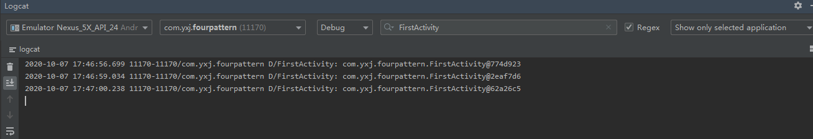
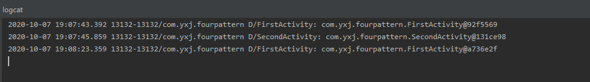
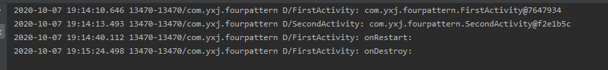
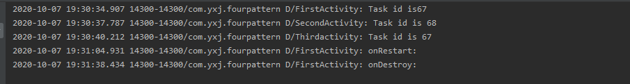

* standard

> 对于使用standard模式的活动， 系统不会在乎这个活动是否已经在返回栈中存在，每次启动都会创建该活动的一个新的实例



```java
  protected void onCreate(Bundle savedInstanceState) {
        super.onCreate(savedInstanceState);
        Log.d("FirstActivity", this.toString());
        setContentView(R.layout.first_layout);
        Button button1 = (Button) findViewById(R.id.button_1);
        button1.setOnClickListener(new View.OnClickListener() {
            @Override
            public void onClick(View v) {
                startActivity(new Intent(FirstActivity.this, FirstActivity.class));

            }
        });

    }
```

* singleTop

> 当活动的启动模式指定为 singleTop,在启动活动时如果发现返回栈的栈顶已经是该活动，则认为可以直接使用它，不会再 创建新的活动实例。



* sigleTask

> 当活动的启动模式指定为singleTask,每次启动该活动时系统首先会在返回栈中检查是否 存在该活动的实例，如果发现已经存在则直接使用该实例，并把在这个活动之上的所有活动统统 出栈，如果没有发现就会创建一个新的活动实例。



* singleInstance

> 在这种模式下会有一个单独的返回栈来管理这个活动，不管是哪个应用程序来访问这个活动，都 共用的同一个返回栈，也就解决了共享活动实例的问题



