## 1.常用控件
### 1.1 TextView

```markdown
用android:layout width和 android: layout height指定了控件的宽度和高度。Android中所有的控件都具有这两个属性， 可选值有 3 种：match parentA fill parent 和 wrap contento 其中 match parent 和 fill parent的意义相同，现在官方更加推荐使用match parento match parent表示让当前 控件的大小和父布局的大小一样，也就是由父布局来决定当前控件的大小。wrap_content表示 让当前控件的大小能够刚好包含住里面的内容，也就是由控件内容决定当前控件的大小。所以上 面的代码就表示让TextView的宽度和父布局一样宽，也就是手机屏幕的宽度，让TextView的高 度足够包含住里面的内容就行。当然除了使用上述值，你也可以对控件的宽和高指定一个固定的 大小，但是这样做有时会在不同手机屏幕的适配方面岀现问题。
TextView中的文字默认是居左上角对齐的
android:gravity来指定文字的对齐方式，可选值有top、bottom、left、right、 center等，可以用来同时指定多个值，这里我们指定的center,效果等同于center_ vertical | center horizontal,表示文字在垂直和水平方向都居中对齐
and roid: textsize属性可以指定文字的大小，通过and roid: textColo r属性可以指
定文字的颜色，在Android中字体大小使用sp作为单位。
```

### 1.2 Button

```markdown
统会对Button中的所有英文字母自动进行大写转换，如果这不是 你想要的效果，可以使用如下配置来禁用这一默认特性：android:textAllCaps="false"
```
### 1.3	EditText

```markdown
android:hint="Type something here" 显示一些提示性的文 字，然后一旦用户输入了任何内容，这些提示性的文字就会消失。
android:maxLines属性控制行数
```
* MainActivity.java
```java
package com.yxj.uiwidgettest;

import androidx.appcompat.app.AppCompatActivity;

import android.os.Bundle;
import android.view.View;
import android.widget.Button;
import android.widget.EditText;
import android.widget.Toast;

public class MainActivity extends AppCompatActivity implements View.OnClickListener {
    private EditText editText;

    @Override
    protected void onCreate(Bundle savedInstanceState) {
        super.onCreate(savedInstanceState);
        setContentView(R.layout.activity_main);
        Button button = (Button) findViewById(R.id.button);
        editText = (EditText) findViewById(R.id.edit_text);
        button.setOnClickListener(this);

    }


    @Override
    public void onClick(View v) {
        switch (v.getId()){
            case R.id.button:
                String inputText = editText.getText().toString();
                Toast.makeText(MainActivity.this,inputText, Toast.LENGTH_SHORT).show();
                break;
            default:
                break;
        }
    }
}
```
```markdown
首先通过findViewById()方法得到EditText的实例，然后在按钮的点击事件里调用EditText 的getText()方法获取到输入的内容,再调用toString()方法转换成字符串，最后还是老方法， 使用Toast将输入的内容显示出来。
```
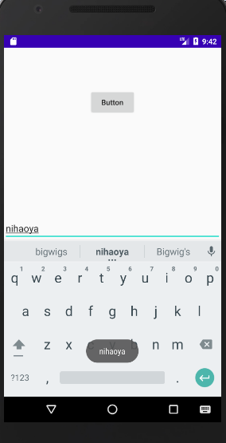
### 1.4	ImageView
```markdown
ImageView是用于在界面上展示图片的一个控件，它可以让我们的程序界面变得更加丰富多 彩。学习这个控件需要提前准备好一些图片，图片通常都是放在以“drawable”开头的目录下的。 目前我们的项目中有一个空的drawable目录，不过由于这个目录没有指定具体的分辨率，所以一 般不使用它来放置图片。这里我们在res目录下新建一个drawable-xhdpi目录，然后将事先准备 好的两张图片img l.png和img_2.png复制到该目录当中
```
* activity_main.xml
```xml
<?xml version="1.0" encoding="utf-8"?>
<androidx.constraintlayout.widget.ConstraintLayout xmlns:android="http://schemas.android.com/apk/res/android"
    xmlns:app="http://schemas.android.com/apk/res-auto"
    xmlns:tools="http://schemas.android.com/tools"
    android:layout_width="match_parent"
    android:layout_height="match_parent"
    tools:context=".MainActivity">

    <TextView
        android:layout_width="wrap_content"
        android:layout_height="wrap_content"
        android:text="Hello World!"
        app:layout_constraintBottom_toTopOf="@+id/guideline3"
        app:layout_constraintLeft_toLeftOf="parent"
        app:layout_constraintRight_toRightOf="parent"
        app:layout_constraintTop_toTopOf="parent" />

    <Button
        android:id="@+id/button"
        android:layout_width="wrap_content"
        android:layout_height="wrap_content"
        android:text="Button"
        android:textAllCaps="false"
        app:layout_constraintBottom_toTopOf="@+id/guideline2"
        app:layout_constraintEnd_toEndOf="parent"
        app:layout_constraintStart_toStartOf="parent"
        app:layout_constraintTop_toTopOf="@+id/guideline" />

    <androidx.constraintlayout.widget.Guideline
        android:id="@+id/guideline"
        android:layout_width="wrap_content"
        android:layout_height="wrap_content"
        android:orientation="horizontal"
        app:layout_constraintGuide_percent="0.21" />

    <androidx.constraintlayout.widget.Guideline
        android:id="@+id/guideline2"
        android:layout_width="wrap_content"
        android:layout_height="wrap_content"
        android:orientation="horizontal"
        app:layout_constraintGuide_percent="0.34" />

    <androidx.constraintlayout.widget.Guideline
        android:id="@+id/guideline3"
        android:layout_width="wrap_content"
        android:layout_height="wrap_content"
        android:orientation="horizontal"
        app:layout_constraintGuide_percent="0.14637482" />

    <EditText
        android:id="@+id/edit_text"
        android:layout_width="match_parent"
        android:layout_height="wrap_content"
        android:hint="Type something here"
        android:maxLines="2"
        app:layout_constraintBottom_toTopOf="@+id/guideline4"
        app:layout_constraintEnd_toEndOf="parent"
        app:layout_constraintHorizontal_bias="0.0"
        app:layout_constraintStart_toStartOf="parent"
        app:layout_constraintTop_toTopOf="@+id/guideline2"
        app:layout_constraintVertical_bias="0.506"></EditText>

    <androidx.constraintlayout.widget.Guideline
        android:id="@+id/guideline4"
        android:layout_width="wrap_content"
        android:layout_height="wrap_content"
        android:orientation="horizontal"
        app:layout_constraintGuide_percent="0.6128591" />

    <ImageView
        android:id="@+id/imageView"
        android:layout_width="wrap_content"
        android:layout_height="wrap_content"
        app:srcCompat="@drawable/img_1"
        tools:layout_editor_absoluteX="121dp"
        tools:layout_editor_absoluteY="488dp" />

</androidx.constraintlayout.widget.ConstraintLayout>
```
* MainActivity.java
```java
package com.yxj.uiwidgettest;

import androidx.appcompat.app.AppCompatActivity;

import android.os.Bundle;
import android.text.Html;
import android.view.View;
import android.widget.Button;
import android.widget.EditText;
import android.widget.ImageView;
import android.widget.Toast;

public class MainActivity extends AppCompatActivity implements View.OnClickListener {
    private EditText editText;
    private ImageView imageView;
    @Override
    protected void onCreate(Bundle savedInstanceState) {
        super.onCreate(savedInstanceState);
        setContentView(R.layout.activity_main);
        Button button = (Button) findViewById(R.id.button);
        editText = (EditText) findViewById(R.id.edit_text);
        imageView = (ImageView)findViewById(R.id.imageView);
        button.setOnClickListener(this);

    }


    @Override
    public void onClick(View v) {
        switch (v.getId()){
            case R.id.button:
                imageView.setImageResource(R.drawable.img_2);
                break;
            default:
                break;
        }
    }
}
```
### 1.5  ProgressBar

```markdown
 Android控件的可见属性。所有的Android控件都具有这个属性，可以通过android: visibility 进行指定，可选值有3种：visible, invisible和gone。visible表示控件是可见的，这个 值是默认值，不指定android:visibility时，控件都是可见的。invisible表示控件不可见， 但是它仍然占据着原来的位置和大小，可以理解成控件变成透明状态了。gone则表示控件不仅 不可见，而且不再占用任何屏幕空间。我们还可以通过代码来设置控件的可见性，使用的是 setvisibility()方法，可以传入 View. VISIBLE. View. INVISIBLE 和 View.GONE 这 3 种值。
 android:max属性给进度条设置一个最大值
```

* activity_main.xml
```xml
<?xml version="1.0" encoding="utf-8"?>
<androidx.constraintlayout.widget.ConstraintLayout xmlns:android="http://schemas.android.com/apk/res/android"
    xmlns:app="http://schemas.android.com/apk/res-auto"
    xmlns:tools="http://schemas.android.com/tools"
    android:layout_width="match_parent"
    android:layout_height="match_parent"
    tools:context=".MainActivity">

    <TextView
        android:layout_width="wrap_content"
        android:layout_height="wrap_content"
        android:text="Hello World!"
        app:layout_constraintBottom_toTopOf="@+id/guideline3"
        app:layout_constraintLeft_toLeftOf="parent"
        app:layout_constraintRight_toRightOf="parent"
        app:layout_constraintTop_toTopOf="parent" />

    <Button
        android:id="@+id/button"
        android:layout_width="wrap_content"
        android:layout_height="wrap_content"
        android:text="Button"
        android:textAllCaps="false"
        app:layout_constraintBottom_toTopOf="@+id/guideline2"
        app:layout_constraintEnd_toEndOf="parent"
        app:layout_constraintStart_toStartOf="parent"
        app:layout_constraintTop_toTopOf="@+id/guideline" />

    <androidx.constraintlayout.widget.Guideline
        android:id="@+id/guideline"
        android:layout_width="wrap_content"
        android:layout_height="wrap_content"
        android:orientation="horizontal"
        app:layout_constraintGuide_percent="0.21" />

    <androidx.constraintlayout.widget.Guideline
        android:id="@+id/guideline2"
        android:layout_width="wrap_content"
        android:layout_height="wrap_content"
        android:orientation="horizontal"
        app:layout_constraintGuide_percent="0.34" />

    <androidx.constraintlayout.widget.Guideline
        android:id="@+id/guideline3"
        android:layout_width="wrap_content"
        android:layout_height="wrap_content"
        android:orientation="horizontal"
        app:layout_constraintGuide_percent="0.14637482" />

    <EditText
        android:id="@+id/edit_text"
        android:layout_width="match_parent"
        android:layout_height="wrap_content"
        android:hint="Type something here"
        android:maxLines="2"
        app:layout_constraintBottom_toTopOf="@+id/guideline4"
        app:layout_constraintEnd_toEndOf="parent"
        app:layout_constraintHorizontal_bias="0.0"
        app:layout_constraintStart_toStartOf="parent"
        app:layout_constraintTop_toTopOf="@+id/guideline2"
        app:layout_constraintVertical_bias="0.506"></EditText>

    <androidx.constraintlayout.widget.Guideline
        android:id="@+id/guideline4"
        android:layout_width="wrap_content"
        android:layout_height="wrap_content"
        android:orientation="horizontal"
        app:layout_constraintGuide_percent="0.6128591" />

    <ImageView
        android:id="@+id/imageView"
        android:layout_width="wrap_content"
        android:layout_height="wrap_content"
        app:layout_constraintBottom_toTopOf="@+id/guideline6"
        app:layout_constraintEnd_toEndOf="parent"
        app:layout_constraintStart_toStartOf="parent"
        app:layout_constraintTop_toTopOf="@+id/guideline4"
        app:srcCompat="@drawable/img_1" />

    <androidx.constraintlayout.widget.Guideline
        android:id="@+id/guideline6"
        android:layout_width="wrap_content"
        android:layout_height="wrap_content"
        android:orientation="horizontal"
        app:layout_constraintGuide_percent="0.73" />

    <ProgressBar
        android:id="@+id/progressBar"
        style="?android:attr/progressBarStyleHorizontal"
        android:layout_width="match_parent"
        android:layout_height="wrap_content"
        app:layout_constraintBottom_toBottomOf="parent"
        app:layout_constraintEnd_toEndOf="parent"
        app:layout_constraintStart_toStartOf="parent"
        app:layout_constraintTop_toBottomOf="@+id/imageView"
        android:max="100"/>

</androidx.constraintlayout.widget.ConstraintLayout>
```
* MainActivity.java
```java
package com.yxj.uiwidgettest;

import androidx.appcompat.app.AppCompatActivity;

import android.os.Bundle;
import android.text.Html;
import android.view.View;
import android.widget.Button;
import android.widget.EditText;
import android.widget.ImageView;
import android.widget.ProgressBar;
import android.widget.Toast;

public class MainActivity extends AppCompatActivity implements View.OnClickListener {
    private EditText editText;
    private ImageView imageView;
    private ProgressBar progressBar;
    @Override
    protected void onCreate(Bundle savedInstanceState) {
        super.onCreate(savedInstanceState);
        setContentView(R.layout.activity_main);
        Button button = (Button) findViewById(R.id.button);
        editText = (EditText) findViewById(R.id.edit_text);
        imageView = (ImageView)findViewById(R.id.imageView);
         progressBar = (ProgressBar) findViewById(R.id.progressBar);
        button.setOnClickListener(this);

    }


    @Override
    public void onClick(View v) {
        switch (v.getId()){
            case R.id.button:
                int progress = progressBar.getProgress();
                progress += 10;
                progressBar.setProgress(progress);
                break;
            default:
                break;
        }
    }
}
```
### 1.6 AlertDialog

```markdown
AlertDialog 一般都是用于提示一些非常重要的内容或者 警告信息。比如为了防止用户误删重要内容，在删除前弹出一个确认对话框
```
* activity_main.xml


```xml
<?xml version="1.0" encoding="utf-8"?>
<androidx.constraintlayout.widget.ConstraintLayout xmlns:android="http://schemas.android.com/apk/res/android"
    xmlns:app="http://schemas.android.com/apk/res-auto"
    xmlns:tools="http://schemas.android.com/tools"
    android:layout_width="match_parent"
    android:layout_height="match_parent"
    tools:context=".MainActivity">

    <TextView
        android:layout_width="wrap_content"
        android:layout_height="wrap_content"
        android:text="Hello World!"
        app:layout_constraintBottom_toTopOf="@+id/guideline3"
        app:layout_constraintLeft_toLeftOf="parent"
        app:layout_constraintRight_toRightOf="parent"
        app:layout_constraintTop_toTopOf="parent" />

    <Button
        android:id="@+id/button"
        android:layout_width="wrap_content"
        android:layout_height="wrap_content"
        android:text="Button"
        android:textAllCaps="false"
        app:layout_constraintBottom_toTopOf="@+id/guideline2"
        app:layout_constraintEnd_toEndOf="parent"
        app:layout_constraintStart_toStartOf="parent"
        app:layout_constraintTop_toTopOf="@+id/guideline" />

    <androidx.constraintlayout.widget.Guideline
        android:id="@+id/guideline"
        android:layout_width="wrap_content"
        android:layout_height="wrap_content"
        android:orientation="horizontal"
        app:layout_constraintGuide_percent="0.21" />

    <androidx.constraintlayout.widget.Guideline
        android:id="@+id/guideline2"
        android:layout_width="wrap_content"
        android:layout_height="wrap_content"
        android:orientation="horizontal"
        app:layout_constraintGuide_percent="0.34" />

    <androidx.constraintlayout.widget.Guideline
        android:id="@+id/guideline3"
        android:layout_width="wrap_content"
        android:layout_height="wrap_content"
        android:orientation="horizontal"
        app:layout_constraintGuide_percent="0.14637482" />

    <EditText
        android:id="@+id/edit_text"
        android:layout_width="match_parent"
        android:layout_height="wrap_content"
        android:hint="Type something here"
        android:maxLines="2"
        app:layout_constraintBottom_toTopOf="@+id/guideline4"
        app:layout_constraintEnd_toEndOf="parent"
        app:layout_constraintHorizontal_bias="0.0"
        app:layout_constraintStart_toStartOf="parent"
        app:layout_constraintTop_toTopOf="@+id/guideline2"
        app:layout_constraintVertical_bias="0.506"></EditText>

    <androidx.constraintlayout.widget.Guideline
        android:id="@+id/guideline4"
        android:layout_width="wrap_content"
        android:layout_height="wrap_content"
        android:orientation="horizontal"
        app:layout_constraintGuide_percent="0.6128591" />

    <ImageView
        android:id="@+id/imageView"
        android:layout_width="wrap_content"
        android:layout_height="wrap_content"
        app:layout_constraintBottom_toTopOf="@+id/guideline6"
        app:layout_constraintEnd_toEndOf="parent"
        app:layout_constraintStart_toStartOf="parent"
        app:layout_constraintTop_toTopOf="@+id/guideline4"
        app:srcCompat="@drawable/img_1" />

    <androidx.constraintlayout.widget.Guideline
        android:id="@+id/guideline6"
        android:layout_width="wrap_content"
        android:layout_height="wrap_content"
        android:orientation="horizontal"
        app:layout_constraintGuide_percent="0.73" />

    <ProgressBar
        android:id="@+id/progressBar"
        style="?android:attr/progressBarStyleHorizontal"
        android:layout_width="match_parent"
        android:layout_height="wrap_content"
        android:max="100"
        app:layout_constraintBottom_toTopOf="@+id/guideline7"
        app:layout_constraintEnd_toEndOf="parent"
        app:layout_constraintHorizontal_bias="0.0"
        app:layout_constraintStart_toStartOf="parent"
        app:layout_constraintTop_toBottomOf="@+id/imageView"
        app:layout_constraintVertical_bias="0.653" />

    <androidx.constraintlayout.widget.Guideline
        android:id="@+id/guideline7"
        android:layout_width="wrap_content"
        android:layout_height="wrap_content"
        android:orientation="horizontal"
        app:layout_constraintGuide_begin="611dp" />


</androidx.constraintlayout.widget.ConstraintLayout>
```
* MainActivity.java
```java
package com.yxj.uiwidgettest;

import androidx.appcompat.app.AlertDialog;
import androidx.appcompat.app.AppCompatActivity;

import android.app.Dialog;
import android.content.DialogInterface;
import android.os.Bundle;
import android.text.Html;
import android.view.View;
import android.widget.Button;
import android.widget.EditText;
import android.widget.ImageView;
import android.widget.ProgressBar;
import android.widget.Toast;

public class MainActivity extends AppCompatActivity implements View.OnClickListener {
    private EditText editText;
    private ImageView imageView;
    private ProgressBar progressBar;
    @Override
    protected void onCreate(Bundle savedInstanceState) {
        super.onCreate(savedInstanceState);
        setContentView(R.layout.activity_main);
        Button button = (Button) findViewById(R.id.button);
        editText = (EditText) findViewById(R.id.edit_text);
        imageView = (ImageView)findViewById(R.id.imageView);
         progressBar = (ProgressBar) findViewById(R.id.progressBar);
        button.setOnClickListener(this);

    }


    @Override
    public void onClick(View v) {
        switch (v.getId()){
            case R.id.button:
            // 首先通过AlertDialog.Builder创建一个AlertDialog的实例，然后可以为这个对话框设置标题、 内容、可否取消等属性，接下来调用setPositiveButton()方法为对话框设置确定按钮的点击 事件，调用setNegativeButton ()方法设置取消按钮的点击事件，最后调用show()方法将对话 框显示出来
                AlertDialog.Builder dialog = new AlertDialog.Builder(MainActivity.this);
                dialog.setTitle("This is a Dialog");
                dialog.setMessage("Something important");
                dialog.setCancelable(true);
                dialog.setPositiveButton("OK", new DialogInterface.OnClickListener() {
                    @Override
                    public void onClick(DialogInterface dialog, int which) {

                    }
                });

                dialog.setNegativeButton("Cancel", new DialogInterface.OnClickListener() {
                    @Override
                    public void onClick(DialogInterface dialog, int which) {

                    }
                });
                dialog.show();
                break;
            default:
                break;

        }
    }
}
```
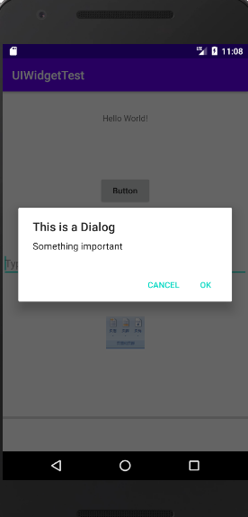
### 1.7ProgressDialog

```markdown
rogressDialog和AlertDialog有点类似，都可以在界面上弹出一个对话框，都能够屏蔽掉其 他控件的交互能力。不同的是，ProgressDialog会在对话框中显示一个进度条，一般用于表示当 前操作比较耗时，让用户耐心地等待。它的用法和AlertDialog也比较相似
```
* MainActivity.java
```java
package com.yxj.uiwidgettest;

import androidx.appcompat.app.AlertDialog;
import androidx.appcompat.app.AppCompatActivity;

import android.app.Dialog;
import android.app.ProgressDialog;
import android.content.DialogInterface;
import android.os.Bundle;
import android.text.Html;
import android.view.View;
import android.widget.Button;
import android.widget.EditText;
import android.widget.ImageView;
import android.widget.ProgressBar;
import android.widget.Toast;

public class MainActivity extends AppCompatActivity implements View.OnClickListener {
    private EditText editText;
    private ImageView imageView;
    private ProgressBar progressBar;
    @Override
    protected void onCreate(Bundle savedInstanceState) {
        super.onCreate(savedInstanceState);
        setContentView(R.layout.activity_main);
        Button button = (Button) findViewById(R.id.button);
        editText = (EditText) findViewById(R.id.edit_text);
        imageView = (ImageView)findViewById(R.id.imageView);
         progressBar = (ProgressBar) findViewById(R.id.progressBar);
        button.setOnClickListener(this);

    }


    @Override
    public void onClick(View v) {
        switch (v.getId()){
            case R.id.button:
                ProgressDialog progressDialog = new ProgressDialog(MainActivity.this);
                progressDialog.setTitle("This is ProgressDialog");
                progressDialog.setMessage("Loading...");
                progressDialog.setCancelable(true);
                progressDialog.show();
                break;
            default:
                break;

        }
    }
}
```
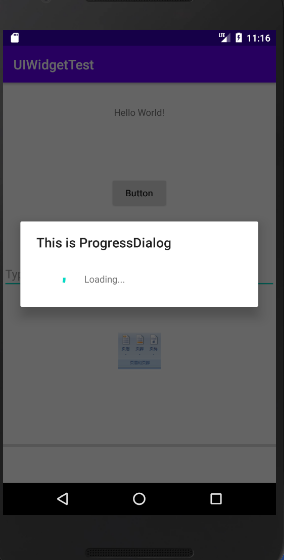
## 2. 4种基本布局
### 2.1 线性布局
```markdown
LinearLayout又称作线性布局，是一种非常常用的布局。正如它的名字所描述的一样，这个 布局会将它所包含的控件在线性方向上依次排列.
android:orientation属性指定了排列方向是vertical,如果指定的是 horizontal,控件就会在水平方向上排列了
如果不指定android:orientation属性的值，默认的排列方向 就是horizontal
```
* 注意

```markdown
这里需要注意，如果LinearLayout的排列方向是horizontal,内部的控件就绝对不能将宽度 指定为match_parent,因为这样的话，单独一个控件就会将整个水平方向占满，其他的控件就 没有可放置的位置了。同样的道理，如果LinearLayout的排列方向是vertical,内部的控件就不能 将高度指定为match_parent

android:gravity 用于指定文字在控件中的对齐方式，而android: layout_gravity用于指定控件在布局中的对 齐方式。android:layout_gravity的可选值和android:gravity差不多，但是需要注意，当 LinearLayout的排列方向是horizontal时，只有垂直方向上的对齐方式才会生效，因为此时水平方 向上的长度是不固定的，每添加一个控件，水平方向上的长度都会改变，因而无法指定该方向上 的对齐方式。同样的道理，当LinearLayout的排列方向是vertical时，只有水平方向上的对齐方 式才会生效。
```


* AndroidManifest.xml

```xml
<?xml version="1.0" encoding="utf-8"?>
<androidx.constraintlayout.widget.ConstraintLayout xmlns:android="http://schemas.android.com/apk/res/android"
    xmlns:app="http://schemas.android.com/apk/res-auto"
    xmlns:tools="http://schemas.android.com/tools"
    android:layout_width="match_parent"
    android:layout_height="match_parent"
    tools:context=".MainActivity">

    <LinearLayout
        android:layout_width="match_parent"
        android:layout_height="match_parent"
        android:orientation="horizontal">

        <Button
            android:id="@+id/button1"
            android:layout_width="wrap_content"
            android:layout_height="wrap_content"
            android:text="Button1"
            android:layout_gravity="top"/>

        <Button
            android:id="@+id/button2"
            android:layout_width="wrap_content"
            android:layout_height="wrap_content"
            android:text="Button2"
            android:layout_gravity="center_vertical"/>

        <Button
            android:id="@+id/button3"
            android:layout_width="wrap_content"
            android:layout_height="wrap_content"
            android:text="Button3"
            android:layout_gravity="bottom"/>


    </LinearLayout>

</androidx.constraintlayout.widget.ConstraintLayout>
```
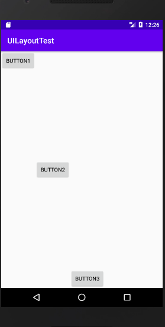

* android:layout_weight
```markdown
这个
属性允许我们使用比例的方式来指定控件的大小，它在手机屏幕的适配性方面可以起到非常重要 的作用。比如我们正在编写一个消息发送界面，需要一个文本编辑框和一个发送按钮

dp是Android中用于指定控件大小、间距等属性的单位

这里我们仅指定了 EditText的android:layout_weight属性，并将Button的宽度改回 wrap_content()这表示Button的宽度仍然按照wrap_content来计算，而EditText则会占满屏 幕所有的剩余空间。使用这种方式编写的界面，不仅在各种屏幕的适配方面会非常好，而且看起 来也更加舒服。
```

```xml
<?xml version="1.0" encoding="utf-8"?>
<androidx.constraintlayout.widget.ConstraintLayout xmlns:android="http://schemas.android.com/apk/res/android"
    xmlns:app="http://schemas.android.com/apk/res-auto"
    xmlns:tools="http://schemas.android.com/tools"
    android:layout_width="match_parent"
    android:layout_height="match_parent"
    tools:context=".MainActivity">

    <LinearLayout
        android:layout_width="match_parent"
        android:layout_height="match_parent"
        android:orientation="horizontal">

        <EditText
            android:layout_width="0dp"
            android:layout_height="match_parent"
            android:id="@+id/input_message"
            android:layout_weight="1"
            android:hint="Type something"></EditText>

        <Button
            android:layout_width="wrap_content"
            android:layout_height="wrap_content"
            android:text="Send">

        </Button>


    </LinearLayout>

</androidx.constraintlayout.widget.ConstraintLayout>
```
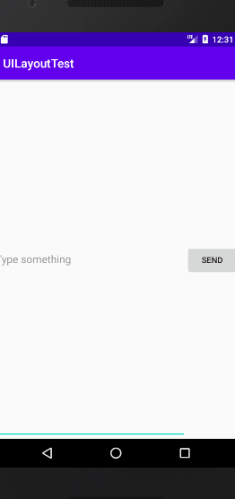
### 2.2 相对布局
```markdown
每个控件都是相对于父布局进行定位的
```
* activity_main.xml
```xml
<?xml version="1.0" encoding="utf-8"?>
<androidx.constraintlayout.widget.ConstraintLayout xmlns:android="http://schemas.android.com/apk/res/android"
    xmlns:app="http://schemas.android.com/apk/res-auto"
    xmlns:tools="http://schemas.android.com/tools"
    android:layout_width="match_parent"
    android:layout_height="match_parent"
    tools:context=".MainActivity">

    <RelativeLayout
        android:layout_width="match_parent"
        android:layout_height="match_parent">

        <Button
            android:id="@+id/button1"
            android:layout_width="wrap_content"
            android:layout_height="wrap_content"
            android:layout_alignParentLeft="true"
            android:layout_alignParentTop="true"
            android:text="Button1" />


        <Button
            android:id="@+id/button2"
            android:layout_width="wrap_content"
            android:layout_height="wrap_content"
           android:layout_alignParentRight="true"
            android:layout_alignParentTop="true"
            android:text="Button2" />


        <Button
            android:id="@+id/button3"
            android:layout_width="wrap_content"
            android:layout_height="wrap_content"
           android:layout_centerInParent="true"
            android:text="Button" />

        <Button
            android:id="@+id/button4"
            android:layout_width="wrap_content"
            android:layout_height="wrap_content"
            android:layout_alignParentBottom="true"
            android:layout_alignParentLeft="true"
            android:text="Button4" />

        <Button
            android:id="@+id/button5"
            android:layout_width="wrap_content"
            android:layout_height="wrap_content"
            android:layout_alignParentBottom="true"
            android:layout_alignParentRight="true"
            android:text="Button" />


    </RelativeLayout>

</androidx.constraintlayout.widget.ConstraintLayout>
```
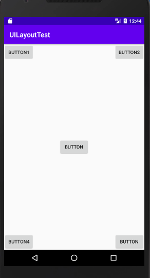

```markdown
控件可以相对于控件进行定位
```

```xml
<?xml version="1.0" encoding="utf-8"?>
<androidx.constraintlayout.widget.ConstraintLayout xmlns:android="http://schemas.android.com/apk/res/android"
    xmlns:app="http://schemas.android.com/apk/res-auto"
    xmlns:tools="http://schemas.android.com/tools"
    android:layout_width="match_parent"
    android:layout_height="match_parent"
    tools:context=".MainActivity">

    <RelativeLayout
        android:layout_width="match_parent"
        android:layout_height="match_parent">


        <Button
            android:id="@+id/button3"
            android:layout_width="wrap_content"
            android:layout_height="wrap_content"
            android:layout_centerInParent="true"
            android:text="Button 3" />


        <Button
            android:id="@+id/button1"
            android:layout_width="wrap_content"
            android:layout_height="wrap_content"
            android:layout_above="@+id/button3"
            android:layout_toLeftOf="@+id/button3"
            android:text="Button 1" />


        <Button
            android:id="@+id/button2"
            android:layout_width="wrap_content"
            android:layout_height="wrap_content"
           android:layout_above="@+id/button3"
            android:layout_toRightOf="@+id/button3"

            android:text="Button2" />

        <Button
            android:id="@+id/button4"
            android:layout_width="wrap_content"
            android:layout_height="wrap_content"
            android:layout_below="@+id/button3"
            android:layout_toLeftOf="@+id/button3"
            android:text="Button 4" />

        <Button
            android:id="@+id/button5"
            android:layout_width="wrap_content"
            android:layout_height="wrap_content"
           android:layout_below="@+id/button3"
            android:layout_toRightOf="@+id/button3"
            android:text="Button" />
        

    </RelativeLayout>

</androidx.constraintlayout.widget.ConstraintLayout>
```

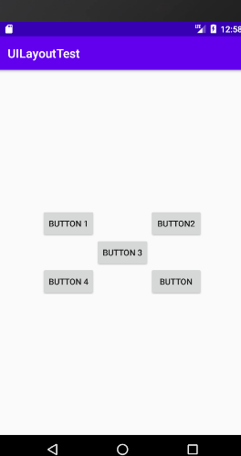
### 2.3 帧布局

```markdown
FrameLayout又称作帧布局，它相比于前面两种布局就简单太多了，因此它的应用场景也少 了很多。这种布局没有方便的定位方式，所有的控件都会默认摆放在布局的左上角。

FrameLayout又称作帧布局，它相比于前面两种布局就简单太多了，因此它的应用场景也少 了很多。这种布局没有方便的定位方式，所有的控件都会默认摆放在布局的左上角。
```

```xml
<?xml version="1.0" encoding="utf-8"?>
<androidx.constraintlayout.widget.ConstraintLayout xmlns:android="http://schemas.android.com/apk/res/android"
    xmlns:app="http://schemas.android.com/apk/res-auto"
    xmlns:tools="http://schemas.android.com/tools"
    android:layout_width="match_parent"
    android:layout_height="match_parent"
    tools:context=".MainActivity">

    <FrameLayout
        android:layout_width="match_parent"
        android:layout_height="match_parent"
        >
        <TextView
            android:id="@+id/text_view"
            android:layout_width="wrap_content"
            android:layout_height="wrap_content"
            android:text="This is TextView"></TextView>
        <ImageView
            android:layout_width="wrap_content"
            android:layout_height="wrap_content"
            android:id="@+id/image_view"
            android:src="@mipmap/ic_launcher"></ImageView>
    </FrameLayout>
</androidx.constraintlayout.widget.ConstraintLayout>
```


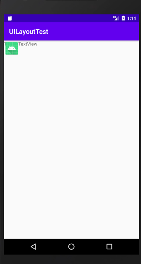
```markdown
我们指定TextView在FrameLayout中居左对齐，指定ImageView在FrameLayout中居右对齐
```
```xml
<?xml version="1.0" encoding="utf-8"?>
<androidx.constraintlayout.widget.ConstraintLayout xmlns:android="http://schemas.android.com/apk/res/android"
    xmlns:app="http://schemas.android.com/apk/res-auto"
    xmlns:tools="http://schemas.android.com/tools"
    android:layout_width="match_parent"
    android:layout_height="match_parent"
    tools:context=".MainActivity">

    <FrameLayout
        android:layout_width="match_parent"
        android:layout_height="match_parent"
        >
        <TextView
            android:id="@+id/text_view"
            android:layout_width="wrap_content"
            android:layout_height="wrap_content"
            android:text="This is TextView"
            android:layout_gravity="left"></TextView>
        <ImageView
            android:layout_width="wrap_content"
            android:layout_height="wrap_content"
            android:id="@+id/image_view"
            android:src="@mipmap/ic_launcher"
            android:layout_gravity="right"></ImageView>
    </FrameLayout>
</androidx.constraintlayout.widget.ConstraintLayout>
```

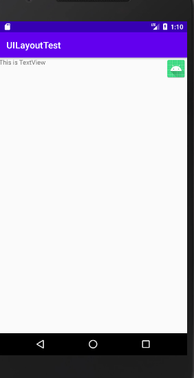
### 2.5.引入布局
```markdown
一般我们的程序中可能有很多个活动都需要这样的标题栏，如果在每个活动的布局中都编 写一遍同样的标题栏代码，明显就会导致代码的大量重复。这个时候我们就可以使用引入布局的 方式来解决这个问题

只需要通过一行include语句将标题栏布局引入进来就可以了
```
* title.xml

```xml
<?xml version="1.0" encoding="utf-8"?>
<LinearLayout xmlns:android="http://schemas.android.com/apk/res/android"
    android:layout_width="match_parent"
    android:layout_height="wrap_content"
    android:background="@drawable/title_bg">


    <Button
        android:id="@+id/title_back"
        android:layout_width="wrap_content"
        android:layout_height="wrap_content"
        android:layout_gravity="center"
        android:layout_margin="5dp"
        android:background="@drawable/back_bg"
        android:text="Back"
        android:textColor="#fff"/>

    <TextView
        android:id="@+id/title_text"
        android:layout_width="0dp"
        android:layout_height="wrap_content"
        android:layout_gravity="center"
        android:layout_weight="1"
        android:gravity="center"
        android:text="Title Text"
        android:textColor="#fff"
        android:textSize="24sp"/>


    <Button
        android:id="@+id/title_edit"
        android:layout_width="wrap_content"
        android:layout_height="wrap_content"
        android:layout_gravity="center"
        android:layout_margin="5dp"
        android:background="@drawable/edit_bg"
        android:text="Edit"
        android:textColor="#fff"></Button>
</LinearLayout>

```
* activity_main.xml

```xml
<?xml version="1.0" encoding="utf-8"?>
<androidx.constraintlayout.widget.ConstraintLayout xmlns:android="http://schemas.android.com/apk/res/android"
    xmlns:app="http://schemas.android.com/apk/res-auto"
    xmlns:tools="http://schemas.android.com/tools"
    android:layout_width="match_parent"
    android:layout_height="match_parent"
    tools:context=".MainActivity">

    <include layout="@layout/title"></include>

</androidx.constraintlayout.widget.ConstraintLayout>
```
* MainActivity.java
```java
package com.yxj.uicustomviews;

import androidx.appcompat.app.ActionBar;
import androidx.appcompat.app.AppCompatActivity;

import android.os.Bundle;

public class MainActivity extends AppCompatActivity {

    @Override
    protected void onCreate(Bundle savedInstanceState) {
        super.onCreate(savedInstanceState);
        setContentView(R.layout.activity_main);
     // 这里我们调用了 getSupportActionBar()方法来获得ActionBar的实例，然后再调用 ActionBar的hide()方法将标题栏隐藏起来
        ActionBar actionBar = getSupportActionBar();
        if (actionBar != null) {
            actionBar.hide();
        }
    }
}
```
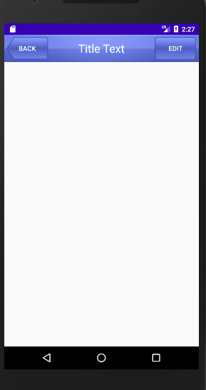
### 2.5.创建自定义控件

```markdown
引入布局的技巧确实解决了重复编写布局代码的问题，但是如果布局中有一些控件要求能够 响应事件，我们还是需要在每个活动中为这些控件单独编写一次事件注册的代码。比如说标题栏 中的返回按钮，其实不管是在哪一个活动中，这个按钮的功能都是相同的，即销毁当前活动。而 如果在每一个活动中都需要重新注册一遍返回按钮的点击事件，无疑会增加很多重复代码，这种 情况最好是使用自定义控件的方式来解决。
```
* TitleLayout.java
```java
package com.yxj.uicustomviews;

import android.app.Activity;
import android.content.Context;
import android.util.AttributeSet;
import android.view.LayoutInflater;
import android.view.View;
import android.widget.Button;
import android.widget.LinearLayout;
import android.widget.Toast;

import androidx.annotation.Nullable;


public class TitleLayout extends LinearLayout {


    public TitleLayout(Context context, @Nullable AttributeSet attrs) {
        super(context, attrs);
// 首先我们重写了 LinearLayout中带有两个参数的构造函数，在布局中引入TitleLayout控件就 会调用这个构造函数。然后在构造函数中需要对标题栏布局进行动态加载，这就要借助 Layoutlnflater来实现了。通过 Layoutlnflater 的 from()方法可以构建出一个 Layoutlnflater 对 象，然后调用inflate()方法就可以动态加载一个布局文件，inflate方法接收两个参数，第一个参数是要加载的布局文件的id,这里我们传入R.layout.title,第二个参数是给加载好的布局 再添加一个父布局，这里我们想要指定为TitleLayout,于是直接传入this.
        LayoutInflater.from(context).inflate(R.layout.title,this);
        Button titleBack = (Button) findViewById(R.id.title_back);
        Button titleEdit = (Button) findViewById(R.id.title_edit);
        titleBack.setOnClickListener(new OnClickListener() {
            @Override
            public void onClick(View v) {
                ((Activity)getContext()).finish();
            }
        });

        titleEdit.setOnClickListener(new OnClickListener() {
            @Override
            public void onClick(View v) {
                Toast.makeText(getContext(),"You clicked Edit button",Toast.LENGTH_SHORT).show();
            }
        });

    }
}
```
* activity_main.xml

```xml
<?xml version="1.0" encoding="utf-8"?>
<androidx.constraintlayout.widget.ConstraintLayout xmlns:android="http://schemas.android.com/apk/res/android"
    xmlns:app="http://schemas.android.com/apk/res-auto"
    xmlns:tools="http://schemas.android.com/tools"
    android:layout_width="match_parent"
    android:layout_height="match_parent"
    tools:context=".MainActivity">

    <com.yxj.uicustomviews.TitleLayout
        android:layout_width="match_parent"
        android:layout_height="wrap_content">

    </com.yxj.uicustomviews.TitleLayout>

</androidx.constraintlayout.widget.ConstraintLayout>
```
* title.xml

```xml
<?xml version="1.0" encoding="utf-8"?>
<LinearLayout xmlns:android="http://schemas.android.com/apk/res/android"
    android:layout_width="match_parent"
    android:layout_height="wrap_content"
    android:background="@drawable/title_bg">


    <Button
        android:id="@+id/title_back"
        android:layout_width="wrap_content"
        android:layout_height="wrap_content"
        android:layout_gravity="center"
        android:layout_margin="5dp"
        android:background="@drawable/back_bg"
        android:text="Back"
        android:textColor="#fff"/>

    <TextView
        android:id="@+id/title_text"
        android:layout_width="0dp"
        android:layout_height="wrap_content"
        android:layout_gravity="center"
        android:layout_weight="1"
        android:gravity="center"
        android:text="Title Text"
        android:textColor="#fff"
        android:textSize="24sp"/>


    <Button
        android:id="@+id/title_edit"
        android:layout_width="wrap_content"
        android:layout_height="wrap_content"
        android:layout_gravity="center"
        android:layout_margin="5dp"
        android:background="@drawable/edit_bg"
        android:text="Edit"
        android:textColor="#fff"></Button>
</LinearLayout>

```
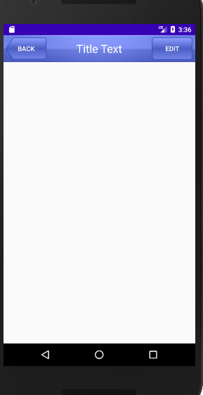